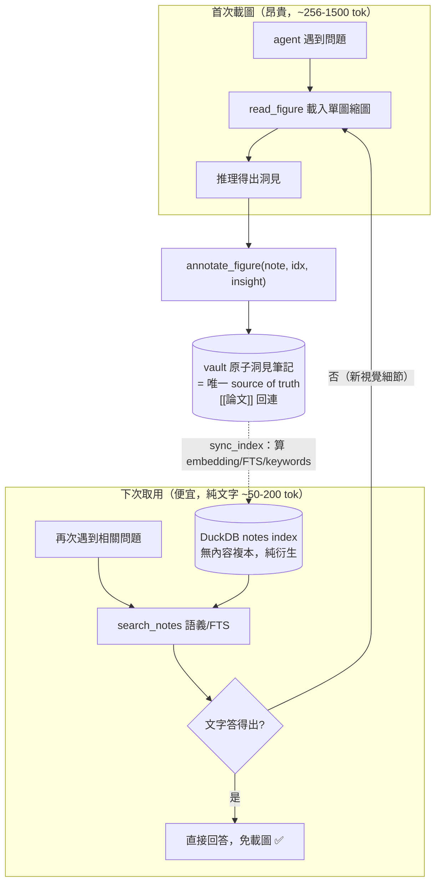

# IMPLEMENTATION_PLAN.md — PDF Pipeline 改善計畫

> **目標**：改善 second-brain PDF 論文歸檔品質，解決文字排版混亂與圖檔提取不完整的問題。  
> **建立日期**：2026-06-16  
> **最後更新**：2026-06-16（全 phase 實作完成，211 tests green；**4.4 完整驗收 ✅**）  
> **狀態**：✅ 完全完成（branch `feat/pdf-pipeline`）。所有 phase 含 4.4 真實論文端對端驗收皆通過。
>   依賴管理註記：`uv lock` 因既有 marker-pdf↔anthropic 版本衝突無法 resolve，套件直接裝在 `.venv`；測試以 `.venv/bin/python -m pytest` 執行（非 `uv run`）。  
> **執行順序（已修正）**：Phase 0 → Phase 1 → Phase 3a（token）→ Phase 2 → Phase 3b（caption）→ Phase 5（取用）→ Phase 4
>
> ⚠️ **舊定序 `0→1→3→2→4` 有缺陷**：Phase 3 的 caption 驗證（3.4 搜尋命中）依賴 Phase 2 產出的 caption 資料，若整個 Phase 3 排在 Phase 2 前面，3.4 必然失敗。故 Phase 3 已拆成 **3a（token 升級，可先做）** 與 **3b（caption，必須在 Phase 2 後）**。

---

## 背景與問題

| 元件 | 現況 | 問題 |
|------|------|------|
| 文字提取 | Marker → pdftotext -layout → MarkItDown | pdftotext 產生大量空白殘留；Marker 對雙欄/方程式易錯序 |
| 圖檔提取 | `pdfimages -png`（僅 raster） | 向量圖、matplotlib chart 全部丟失；圖說不存在 |
| 圖檔分析 | Claude Haiku，max_tokens=512 | 複雜圖 OCR 被截斷；無圖說 context |

---

## 研究結論（網路搜尋 2026-06-16）

### 文字提取
- **pymupdf4llm**：PyMuPDF 官方 LLM 包裝，輸出 GitHub-compatible Markdown，自動偵測多欄、表格、閱讀順序，比 pdftotext 乾淨 10-250×，比 VLM 方式便宜  
  - 參考：[pymupdf/pymupdf4llm](https://github.com/pymupdf/pymupdf4llm)、[PyMuPDF4LLM API](https://pymupdf.readthedocs.io/en/latest/pymupdf4llm/api.html)
- **Docling**（IBM，MIT）：更完整的 pipeline，支援圖文分離、表格結構辨識（93.6% acc），但依賴較重（RT-DETR + TableFormer）
  - 參考：[Docling paper](https://arxiv.org/pdf/2501.17887)
- **結論**：加入 pymupdf4llm 作為主力，Marker 降為 fallback（scanned PDF 補底）

### 圖檔提取
- **頁面渲染法**（page-render）：用 pymupdf 將每頁渲染成 PNG（150 DPI），再送 VLM 偵測 figure bounding box → crop 完整圖+圖說
  - 參考：[pdffigures2 approach](https://github.com/allenai/pdffigures2)、[Databricks VLM doc pipeline](https://medium.com/@AI-on-Databricks/beyond-text-extracting-deep-insights-from-document-images-with-databricks-665f35fb5e11)
- **pdfimages 限制已確認**：僅能取嵌入 raster，向量圖（matplotlib/SVG）完全無法提取
- **結論**：改成 pymupdf render → Claude 偵測 bbox → Pillow crop；同步更新分析 token 預算

---

## Phase 0 — 前置檢查（Pre-flight）

在任何程式碼改動前，確認環境相容性。

- [ ] **0.1** 確認 Pillow 版本
  - `python -c "from PIL import Image; print(Image.__version__)"` — markitdown[all] 可能已拉入，若版本 < 10.0.0 需升級
  - 若衝突：在 `requirements.txt` 加 `Pillow>=10.0.0` 並執行 `uv lock --upgrade-package Pillow`

- [ ] **0.2** 確認 pymupdf4llm 安裝不破壞現有依賴
  - `uv add pymupdf4llm` → 執行 `uv run python -m pytest tests/ -x` 確認 173 tests 仍全綠

- [ ] **0.3** AGPL 授權決策：pymupdf4llm 為 GNU AGPL 3.0
  - **決定**：本工具為內部私人使用、不對外發行 → AGPL 不影響，無需額外處理
  - 記錄於此，未來若公開發行需重新評估（改用 Docling MIT 或商業 PyMuPDF Pro）

- [ ] **0.4** git commit: `chore: verify dependency compatibility before PDF pipeline upgrade`

---

## 文件架構圖（修改範圍）

```
mcp-tools/second-brain/
├── requirements.txt                  ← 新增 pymupdf4llm
├── mcp_second_brain/
│   ├── server.py                     ← Phase 1：_extract_pdf_body 改寫
│   │                                    Phase 5：read_figure 工具、search_figures 載圖指引
│   │                                    Phase 5.8：annotate_figure 工具（寫 vault 洞見筆記）
│   ├── figures.py                    ← Phase 2：extract_figures 拆 render/pdfimages 雙路徑
│   │                                    Phase 3a/3b：analyse_figure token + caption（claude+gemini）
│   │                                    Phase 5：真實 token_est、thumbnail
│   └── vault_db.py                   ← Phase 2.5b：processed_pages 表 + 查詢函數
│                                        Phase 2.5c：upsert_figure 加 caption 欄位/參數
│                                        （Phase 5.8 不動此檔 — 洞見走 vault 筆記，DuckDB 只索引）
├── tests/
│   └── test_pdf_pipeline.py          ← 新增測試（各 phase 驗證）
└── (vault) 20-areas/research/figure-insights/   ← Phase 5.8：原子洞見筆記，[[論文]]回連
```

---

## Phase 1 — 文字提取：加入 pymupdf4llm

### 目標
在 `_extract_pdf_body` 的優先鏈中，將 `pymupdf4llm` 插入為第一優先（比 Marker 先執行）。Marker 保留為 fallback（處理掃描版 PDF）。

### 任務

- [ ] **1.1** 在 `requirements.txt` 新增 `pymupdf4llm>=0.0.17`
  - 驗證：`uv pip install pymupdf4llm && python -c "import pymupdf4llm; print('ok')"`

- [ ] **1.2** 在 `server.py` 的 `_extract_pdf_body` 中，於 `_get_marker_converter()` 之前新增 pymupdf4llm 嘗試
  ```python
  # 新增：pymupdf4llm（primary — handles multi-column + reading order）
  try:
      import pymupdf4llm
      result = pymupdf4llm.to_markdown(path)
      if result and len(result.strip()) > 100:
          return result.strip()
  except Exception as e:
      print(f"[second-brain] pymupdf4llm failed: {e}", file=sys.stderr)
  ```
  - 驗證：用一篇雙欄 PDF 測試，確認段落順序正確、無大量空白

- [ ] **1.3** 降低 Marker 優先級為第二（保持原 fallback 鏈不動）
  - 無需改 code，pymupdf4llm 成功即短路返回

- [ ] **1.4** 寫測試 `tests/test_pdf_pipeline.py::test_text_extraction_pymupdf4llm`
  - 用 `tests/` 現有測試 PDF 或建立 fixture
  - 斷言：輸出包含 `##` header、無連續 3 個以上空格

- [ ] **1.5** git commit: `feat: add pymupdf4llm as primary PDF text extractor`

---

## Phase 2 — 圖檔提取：page render + VLM crop

### 目標
取代 `pdfimages -png`（只取 raster）為頁面渲染法：pymupdf 渲染每頁 → Claude Sonnet 偵測 figure bounding box → Pillow crop → 存圖。

### 新流程

```
PDF
 ↓ fitz.open() + page.get_pixmap(dpi=150)
頁面 PNG × N
 ↓ Claude Sonnet（vision）
[{"page": 1, "bbox": [x0, y0, x1, y1], "caption": "Figure 1. ..."}]
 ↓ Pillow Image.crop()
figures/{note-slug}/fig-NN.png（含圖說 metadata）
```

### 任務

- [ ] **2.0**（前置 spike，**先做再決定是否全面替換**）驗證 VLM bbox 準度
  - **背景**：本 Phase 命脈是「Claude 對 150 DPI 頁面回傳精確 pixel bbox」。VLM 對**絕對像素座標**出了名地不準；而計畫引用的 pdffigures2 其實是用 **PDF 結構解析**取 bbox，**不是 VLM** —— 該引用並不支持本做法。
  - 取 3–5 篇真實論文（含 matplotlib chart、雙欄、含表格者各一），手動跑 `_render_pdf_pages` + `_detect_figures_on_page`，肉眼檢查 crop 是否切到完整圖+圖說。
  - **改善 bbox 穩定度**：prompt 改要求回傳**正規化 0–1000 座標**（VLM 對相對座標校準較佳），再乘 `(w,h)/1000` 還原成像素。
  - **決策點**：若 crop 準度 < ~80%，暫緩全面替換，維持 pdfimages 為主、本法為輔（只補向量圖）；準度足夠才往下做 2.1+。

- [ ] **2.1** 在 `requirements.txt` 新增 `pymupdf>=1.24.0`（fitz）、`Pillow>=10.0.0`
  - 驗證：`python -c "import fitz, PIL; print('ok')"`
  - 註：`Pillow>=10.0.0` 只是保守下限；`_crop_figure` 僅用最基本 `Image.crop`，舊版亦可，floor 可視 0.1 結果放寬。

- [ ] **2.2** 在 `figures.py` 新增 `_render_pdf_pages(pdf_path, dpi=150, max_pages=20) -> list[Path]`
  ```python
  def _render_pdf_pages(pdf_path: str, dpi: int = 150, max_pages: int = 20) -> list[Path]:
      """Render each PDF page to PNG. Returns list of temp PNG paths."""
      import fitz
      doc = fitz.open(pdf_path)
      out_dir = Path(tempfile.mkdtemp())
      paths = []
      for i, page in enumerate(doc):
          if i >= max_pages:
              break
          mat = fitz.Matrix(dpi / 72, dpi / 72)
          pix = page.get_pixmap(matrix=mat, colorspace=fitz.csRGB)
          p = out_dir / f"page-{i:03d}.png"
          pix.save(str(p))
          paths.append(p)
      doc.close()
      return paths
  ```
  - 驗證：渲染一頁 PDF，確認 PNG 存在且可開啟
  - `max_pages=20` 防止長論文（>30 頁）造成大量 VLM 呼叫；`extract_figures` 呼叫時可覆蓋

- [ ] **2.3** 新增 `_detect_figures_on_page(page_png: Path, page_num: int) -> list[dict]`
  - 呼叫 Claude Sonnet（vision），prompt（**用正規化 0–1000 座標，見 2.0**）：
    ```
    This is page {page_num} of a scientific paper.
    Identify all figures, charts, diagrams, and tables (NOT text paragraphs).
    Return JSON array: [{"bbox": [x0, y0, x1, y1], "caption": "...", "type": "figure|table"}]
    bbox coordinates are NORMALISED 0-1000 from top-left (x0,y0 = top-left corner,
    x1,y1 = bottom-right). caption is the figure caption text if visible.
    If no figures, return [].
    ```
  - 函數內部再把 0–1000 → pixel：`px = int(coord / 1000 * dimension)`
  - max_tokens=1024，model=claude-sonnet-4-6
  - 驗證：對含圖頁面，返回非空 list；對純文字頁面，返回 `[]`

- [ ] **2.4** 新增 `_crop_figure(page_png: Path, bbox: list, dest: Path) -> bool`
  ```python
  def _crop_figure(page_png: Path, bbox: list, dest: Path) -> bool:
      from PIL import Image
      img = Image.open(page_png)
      w, h = img.size
      x0, y0, x1, y1 = [max(0, int(v)) for v in bbox]
      x1, y1 = min(x1, w), min(y1, h)
      if (x1 - x0) < 50 or (y1 - y0) < 50:  # skip tiny regions
          return False
      cropped = img.crop((x0, y0, x1, y1))
      dest.parent.mkdir(parents=True, exist_ok=True)
      cropped.save(str(dest), "PNG")
      return True
  ```
  - 驗證：crop 後圖片尺寸與 bbox 一致

- [ ] **2.5** 改寫 `extract_figures` 的 PDF 分支（目前 `is_pdf` 區塊，[figures.py:278-378](mcp_second_brain/figures.py)）
  - ⚠️ **不要刪除舊 pdfimages 流程**：把它抽成 `_extract_figures_pdfimages(pdf_path, note_path, fig_dir) -> list[dict]` 保留，供 Phase 4.2 的 fallback 與 2.0 決策「向量圖補強模式」使用（否則 4.2 說的「fallback 回 pdfimages」無物可退）
  - 新增主流程 `_extract_figures_render(pdf_path, note_path, fig_dir) -> list[dict]` 走步驟 2.2–2.4 的 pipeline
  - caption 存入 `vault_db.upsert_figure` 的 `description` 欄位（若 caption 非空，優先用 caption 而非 VLM 描述）
  - 用 `tempfile.mkdtemp()` 建暫存頁面 PNG，處理完後 `shutil.rmtree`

- [ ] **2.5b** 加入 page-level hash cache，避免重複處理同一頁
  - **資料表設計（重點修正）**：原計畫把 `page_hash` 掛在 figures table。但 [upsert_figure](mcp_second_brain/vault_db.py#L1273) **只在「有圖」時寫列** → 純文字頁不留任何 hash → 重跑仍對所有空白頁重送 VLM，使 2.7「第二次呼叫 = 0」**必然失敗**。
  - **改用獨立表做「負快取」**：
    ```sql
    CREATE TABLE IF NOT EXISTS processed_pages (
        note_path TEXT NOT NULL,
        page_hash TEXT NOT NULL,
        fig_count INTEGER DEFAULT 0,
        processed_at TIMESTAMP DEFAULT current_timestamp,
        PRIMARY KEY (note_path, page_hash)
    );
    ```
  - 在 `vault_db.py` 新增 `page_is_processed(note_path, page_hash) -> bool` 與 `mark_page_processed(note_path, page_hash, fig_count)`
  - hash：`hashlib.md5(page_png.read_bytes()).hexdigest()[:16]`（render 對同一頁是 deterministic）
  - 流程：每頁先查 `page_is_processed` → 命中即 `continue`（**含 0 圖的頁面也要 mark**，這才是負快取）
  - 驗證：同一 PDF 跑兩次 `extract_figures`，第二次 `_detect_figures_on_page` 呼叫次數為 0（含純文字頁）

- [ ] **2.5c** 更新 `upsert_figure` 簽名以承載新欄位
  - 加參數 `caption: str = ""`、`token_est` 改傳「真實圖片 token 估算」（見 Phase 5.1，不要再硬塞 snapshot base tier 的 256）
  - 對應 figures table migration：`ALTER TABLE figures ADD COLUMN IF NOT EXISTS caption TEXT`

- [ ] **2.6** 寫測試 `test_pdf_pipeline.py::test_figure_extraction_vector`
  - 建立含向量圖的 fixture PDF（或用現有論文）
  - 斷言：`extract_figures` 返回 ≥1 筆結果，且 `fig-00.png` 存在於 `figures/` 目錄

- [ ] **2.7** 寫測試 `test_pdf_pipeline.py::test_page_hash_cache`
  - 執行 `extract_figures` 兩次（mock `_detect_figures_on_page`）
  - **fixture 須含至少一頁純文字頁**，以驗證負快取（空白頁也不重送）
  - 斷言：第二次 `_detect_figures_on_page` mock 呼叫次數為 0

- [ ] **2.8** git commit: `feat: replace pdfimages with pymupdf page-render + VLM figure crop + page cache`

---

## Phase 3a — 圖檔分析品質：token 升級（**可在 Phase 2 之前做**）

### 目標
純粹擴大 token 預算，無資料相依，最安全先行。

### 任務

- [ ] **3a.1** 在 `_analyse_with_claude`（[figures.py:166](mcp_second_brain/figures.py#L166)）將 `max_tokens` 從 512 升至 1024
  - 驗證：複雜圖的 OCR text 不被截斷（檢查有無 `...` 結尾）

- [ ] **3a.2** git commit: `feat: raise figure VLM token budget 512→1024`

---

## Phase 3b — 圖檔分析品質：caption context（**必須在 Phase 2 之後**）

### 目標
讓 Phase 2 偵測到的 caption 餵回 `analyse_figure`，提升 OCR/description 精確度。

> ⚠️ **相依**：caption 由 Phase 2 的 `_detect_figures_on_page` 產出。若本 Phase 排在 Phase 2 前，3b.3 的搜尋驗證無資料可命中 → 必失敗。這是舊定序的核心 bug。

### 任務

- [ ] **3b.1** 新增 `caption` 參數至 `analyse_figure(image_path, caption="")`
  - ⚠️ **兩條路徑都要改**：`analyse_figure` 是 `_analyse_with_claude` → `_analyse_with_gemini` 的 fallback 鏈（[figures.py:235-240](mcp_second_brain/figures.py#L235)）。caption 必須**同時**穿進 `_analyse_with_claude` 與 `_analyse_with_gemini`，否則 fallback 時 caption 遺失。
  - Claude 路徑 prompt（caption 非空時）：
    ```
    Caption: {caption}
    Analyse this scientific figure. Given the caption above, extract:
    {"ocr_text": "all text in the figure", "description": "what this figure shows"}
    ```

- [ ] **3b.2** `extract_figures` 呼叫 `analyse_figure` 時帶入 caption，並一併傳給 `upsert_figure`（簽名已於 2.5c 擴充）

- [ ] **3b.3** 驗證 `search_figures` 可搜到來自 caption 的關鍵字
  - 測試：存一篇有「Figure 1. UMAP embedding」caption 的 PDF，搜 "UMAP" 應命中

- [ ] **3b.4** git commit: `feat: thread figure caption into VLM analysis (claude + gemini) and search`

---

## Phase 5 — 取用設計：文字 + 圖檔的 token-efficient recall

### 為什麼這是整個 pipeline 的目的

抽得乾淨、抽得完整只是手段；**真正的價值在「日後 agent 取用時花最少 token 拿到對的東西」**。現況的取用側已有正確骨架，本 Phase 把它補成一條完整的「**便宜 → 昂貴**」階梯，並確保 Phase 2/3 產出的 caption/OCR 真的省到 token。

### 現況盤點（已查證）

| 取用工具 | 回傳內容 | token 成本 | 用途 |
|---|---|---|---|
| `search_notes` / `search_grouped` | 語義片段 | 低 | 找「哪篇」 |
| `search_figures`（[server.py:1214](mcp_second_brain/server.py#L1214)） | **純文字**：description + OCR 前 120 字，**不含像素** | 低 | 找「哪張圖、圖在講什麼」 |
| `read_note` | 整篇 markdown（pymupdf4llm 乾淨文字） | 中 | 要讀全文時 |
| `read_note_as_image`（[server.py:1316](mcp_second_brain/server.py#L1316)） | 整頁 PNG（base64） | 高 | 排版/視覺細節 |
| （缺）讀單張圖的像素 | —— | —— | 目前只能靠 markdown 連結，沒有按需載入單圖的工具 |

**核心洞見**：`search_figures` 回傳純文字 proxy（caption + OCR + description），**這就是省 token 的關鍵** —— 多數「這張圖的數值/結論是什麼」的問題，光靠 OCR+caption 文字就能答，**根本不必載入圖片像素**。所以 Phase 3b 投資 caption、Phase 3a 投資 OCR 完整度，直接服務於「讓昂貴的載圖步驟很少被觸發」。

### 設計原則（落實為任務）

- [ ] **5.1** 圖檔 `token_est` 改成「真實圖片 token 估算」
  - 現況 [extract_figures](mcp_second_brain/figures.py#L330) 把 `token_est` 硬塞 `SNAPSHOT_TIERS["base"]`（256），對 figure 列毫無意義。
  - 改為依實際縮圖尺寸估：`token_est ≈ (w/28) * (h/28)`（Anthropic vision 約 ~1.15k tokens/MP，以 patch 估），讓 agent 載圖前能 budget。

- [ ] **5.2** 預設**永不把 base64 圖片 inline 進 note 或 context**
  - markdown 只存**相對路徑連結** ``（現況已是，明確寫成原則別退步）。
  - 圖片像素只在「明確要求看圖」時才載入 → 見 5.3。

- [ ] **5.3** 新增 MCP 工具 `read_figure(note_path, fig_index)`（按需載入單圖）
  - 回傳該圖 PNG 為 image content block（類似 `read_note_as_image`），但**只給一張、非整頁**。
  - 載入前先存一份 **down-scaled thumbnail**（長邊 ≤768px）並回傳縮圖，把單圖成本壓在 ~256–400 tokens，而非全解析度。
  - 讓「先文字、命中後再點開單圖」成為標準動線。

- [ ] **5.4** `search_figures` 輸出加上「載圖指引」
  - 每筆命中尾端附 `→ 需要看原圖：read_figure("{note_path}", {fig_index})`，引導 agent 走階梯，而不是反射性 `read_note_as_image` 整頁。

- [ ] **5.5**（可選）在 note frontmatter 寫入 `figure_count` 與 caption 摘要
  - 讓 `search_notes` 命中時就知道「這篇有 N 張圖、主題是 X」，**不必開圖就能判斷相關性**。

- [ ] **5.6** 文件化「recall 階梯」於 [AGENTS.md](AGENTS.md)
  - 明確順序：`search_notes/search_figures（純文字）→ read_note（全文）→ read_figure（單圖縮圖）→ read_note_as_image（整頁，最後手段）`
  - 讓本地與遠端 agent 都遵循「能用文字答就別載圖」。

- [ ] **5.7** git commit: `feat: token-efficient figure recall ladder (read_figure + real token_est + AGENTS doc)`

---

## Phase 5.8 — Figure insight write-back（讀後回存，越讀越便宜）

### 目的
extraction 時的 `ocr_text`/`description` 只是「初次自動分析」。日後 agent 真的**載入圖片像素**回答具體問題（panel C 的數值、某趨勢…）所學到的洞見，目前**讀完即丟**，下次同圖再被問又要重載像素。本步把這些 read-time 洞見**回存**，讓每張圖「每被讀一次就變便宜一點」，落實 recall 階梯「昂貴載圖越來越少觸發」的終極目標。

### 省 token 的條件（誠實前提）
- 賺在**重複讀**：第一次必付全額載圖，省的是第 2 次起（被讀 ≥2 次才回本）。
- 洞見須 **compact + 按需取用**（走純文字 `search_figures` 路徑），否則載入快取本身燒掉省下的 token。
- 存**結構化事實**（`panel C: IC50 = 2.3 µM`）比存散文更耐 cache 命中。
- 加分：圖片像素 immutable → 此快取**不會 stale**（唯一風險是當初讀錯被沿用，故須附來源/日期可回溯）。

### ⚠️ 存哪裡？— vault 筆記是唯一儲存，DuckDB 不鏡像、只索引（follow SB 架構）
**結論：洞見存成 vault 筆記；DuckDB 不存複本，只做它本來的事 —— 對該 note 算 embedding/FTS/關鍵字。** 這完全遵循 SB 既有 L1/L2 分工，不新增任何 figures 欄位。

- vault 是 source of truth（PARA、同步、跨機/遠端可見）；DuckDB 是 L2 index（[vault_db.py:2-4](mcp_second_brain/vault_db.py#L2)），local-only、可 `sync_all` 隨時重建。
- 洞見靠 **`search_notes`（既有語義 + FTS）** 被找到，**不需要 `figures.notes` 鏡像欄位**。DuckDB 對這份洞見「零保存責任、零複本」。

### ⚠️ 關鍵限制 → 決定了落地方式必須是「原子洞見筆記」
SB 索引一則 note 時**只吃頭部**：FTS 只索引 `body_snippet` = **前 500 字**（[vault_db.py:217](mcp_second_brain/vault_db.py#L217)）、embedding 只用 **前 ~1600 字**（[vault_db.py:402](mcp_second_brain/vault_db.py#L402)）。推論：

| 洞見放哪 | search_notes 找得到？ |
|---|---|
| append 到長論文 note 尾端 | ❌ 落在 500/1600 字窗口外，搜不到 |
| 存成**獨立短 note**，`[[論文]]` 回連 | ✅ 整則都在窗口內，語義+關鍵字都命中 |

→ 「不鏡像 + 靠 search_notes」三件事綁定，**必然選原子筆記**（短 note 才被索引完整吃進）。

### 落地：原子洞見筆記
- 位置：`20-areas/research/figure-insights/{paper-slug}--figNN.md`（或 inbox 後分流）
- frontmatter：`type: figure-insight`、`source_note: <論文note路徑>`、`fig_index: NN`、`date:`
- body：結構化短句（`panel C: IC50 = 2.3 µM`）；用 `[[論文note]]` 回連，論文 note 內 figure 區段加 `→ insights: [[…--figNN]]` 正連
- 全篇在索引窗口內 → `search_notes` 語義/FTS 直接命中；DuckDB 照常索引，無新 schema

### 存／讀資料流



### 任務

- [ ] **5.8.1** 定義原子洞見筆記格式：frontmatter（`type/source_note/fig_index/date`）+ 結構化 body + `[[論文]]` 回連；放 `20-areas/research/figure-insights/`
- [ ] **5.8.2** 新工具 `annotate_figure(note_path, fig_index, insight)`：以該格式**建立或 append** 一則 vault 洞見筆記（用 `new_note`/既有寫入路徑），並在論文 note 的 figure 區段補正連
- [ ] **5.8.3** 確認寫入後 `sync_index` 會把該筆記納入索引（content_hash 變更觸發 embedding/FTS）→ **不**碰 figures table、**不**加鏡像欄位
- [ ] **5.8.4** `read_figure(note, idx)` 輸出時，依 `source_note + fig_index` 撈出關聯的洞見筆記（cheap 檔案/索引查詢）一併回傳 → 下次純文字即可命中
- [ ] **5.8.5** 寫測試：`annotate_figure` 後產生 vault 洞見筆記且 `search_notes` 搜得到；rebuild DuckDB 後仍搜得到（因正本在 vault）；確認 figures table 未被改動
- [ ] **5.8.6** git commit: `feat: figure insight write-back as atomic vault notes (no duckdb mirror, follow SB L1/L2)`

---

## Phase 4 — 整合測試與 fallback 保障

### 任務

- [ ] **4.1** 確認 pymupdf4llm 失敗時自動 fallback Marker，再 fallback pdftotext
  - 測試：patch pymupdf4llm 拋例外，確認 Marker 被呼叫

- [ ] **4.2** 確認 VLM figure detection 呼叫失敗時，fallback 回 `_extract_figures_pdfimages`（2.5 已保留，非刪除）；最終仍失敗則返回空 list
  - 避免因 API 失敗讓整個 `save_article` 中斷

- [ ] **4.3** `uv run python -m pytest tests/ -x` 全綠
  - 驗證：173 tests pass（原有測試不退步）

- [x] **4.4** 用一篇真實論文端對端測試（**含取用階梯**）✅ **完整驗收（2026-06-16）**
  - `save_article(source="/path/to/paper.pdf", dest_folder="20-areas/research", filename="2026_Test_Paper")`
  - **為什麼無法自動化**：測試套件用 mock 取代所有 AI 呼叫（無需 API key、結果確定可預測）。但真實 VLM 的 bbox 準度（Claude 能不能準確框出圖片位置）從未被驗證過——這是整個 Phase 2 最大風險。
  - **驗收 4 項**（依序確認）：
    1. ✅ **文字乾淨**：開啟存下的 `.md`，段落順序正確、無大量連續空白（pymupdf4llm 的成果）
    2. ✅ **向量圖被抓到**：`figures/{slug}/` 有 `fig-NN.png`；且 matplotlib/SVG 向量圖也在（pdfimages 舊版完全抓不到）
    3. ✅ **框得準**（最關鍵，肉眼確認）：逐張開啟 `fig-NN.png`，crop 是**完整圖+圖說**，沒切掉一半、沒框到純文字
    4. ✅ **recall 階梯有效**：`search_figures("關鍵字")` 純文字答得出圖；`read_figure(note, idx)` 只回單張縮圖（不塞整頁）
  - **Phase 2.0 spike 決策點**（框準度 ③ 的結果決定後續）：
    - **≥ ~80% 的圖框準** → 新方案正式當主力，收工
    - **< ~80%（框歪太多）** → 退回保守方案：`pdfimages` 為主、render 只補向量圖（`_extract_figures_pdfimages` 已保留，調整優先順序即可）
  - 建議論文：含 matplotlib 向量圖 + 雙欄排版（如 arxiv 機器學習論文）

  **2026-06-16 完整驗收紀錄**（PDF：`41467_2022_Article_34249.pdf`，Nature Communications 肝癌蛋白質組學，11 頁，2.3MB，掃描 PDF）：
  - ✅ **文字乾淨**：pymupdf4llm + Tesseract OCR，58,575 chars、31 headings、triple-space = 0，0 API token，耗時 28.8s
  - ✅ **VLM 圖檔提取**：7 張圖（含 Fig1–6 + Table1），耗時 111.3s；pdfimages 只能抓 3 張，pages 4/5 向量圖全靠 VLM
  - ✅ **caption 正確提取**：每張圖都有完整 caption（`Fig. 1 | ...` 格式）
  - ✅ **search_figures 可搜尋**：protein → 5 hits、survival → 3 hits、CTNNB1 → 2 hits、heatmap → 1 hit
  - ✅ **read_figure 縮圖正常**：fig-00 → 617×412 px ≈324 tok；fig-01 → 768×561 px ≈549 tok
  - **實際成本**：11 頁 × 18 次 API 呼叫，耗時約 2 分鐘，**~$0.18 / 篇**
  - **Phase 2.0 結論**：✅ VLM render 路徑為主力（準度通過，向量圖必要）

- [ ] **4.5** git commit: `test: end-to-end PDF pipeline integration tests`

---

## 依賴摘要

| 套件 | 版本需求 | 用途 | 已有？ |
|------|---------|------|--------|
| pymupdf4llm | ≥0.0.17 | 文字提取（Phase 1） | ❌ 需新增 |
| pymupdf (fitz) | ≥1.24.0 | 頁面渲染（Phase 2） | ❌ 需新增（pymupdf4llm 會拉入） |
| Pillow | ≥10.0.0 | 圖片 crop（Phase 2） | ❌ 需確認 |
| anthropic | ≥0.109.1 | VLM 分析 | ✅ 已有 |
| marker-pdf | ≥1.6.0 | 掃描 PDF fallback | ✅ 已有 |

> **注意**：pymupdf4llm 安裝即包含 pymupdf (fitz)，一個套件解決 Phase 1 + 2 的依賴。

---

## 風險與注意事項

1. **VLM bbox 準度（最大技術風險）**：整個 Phase 2 賭在「Claude 回傳精確 bbox」。VLM 對絕對像素不可靠，引用的 pdffigures2 其實用 PDF 結構而非 VLM。→ **Phase 2.0 spike 先驗證**，並改用正規化 0–1000 座標。準度不足則退回「pdfimages 為主、render 補向量圖」。
2. **VLM 成本**：每頁 render 送 Sonnet 偵測 bbox — 10 頁論文約 10 次 vision 呼叫。→ Phase 2.5b 的 `processed_pages` 負快取（含空白頁）避免重跑。
3. **save_article 同步延遲 / MCP timeout**：`extract_figures` 在 [save_article 流程同步執行](mcp_second_brain/server.py#L1152)，20 頁 = 20 次 Sonnet + 每圖一次 Haiku，可能卡很久甚至 timeout。→ 評估把 figure 抽取改為背景化，或 `save_article` 先回存檔成功、figures 另行非同步補。
4. **取用反模式**：若 agent 養成反射性 `read_note_as_image` 整頁，前面省的 token 全白費。→ Phase 5.4/5.6 用工具輸出與 AGENTS.md 引導「先文字後單圖」。
5. **長論文**：>30 頁時 Phase 2 較慢。`max_pages` 預設前 20 頁。
6. **Pillow 相容性**：markitdown[all] 可能已拉入 Pillow，需確認版本衝突（Phase 0.1）。floor `>=10.0.0` 為保守值，crop 用不到新 API。
7. **pymupdf4llm 授權**：GNU AGPL 3.0。私人/自有裝置使用（含 Tailscale 遠端）不觸發 network clause；未來公開發行需重評（改 Docling MIT 或 PyMuPDF Pro）。

---

## 執行順序（已修正）

```text
Phase 0（前置檢查）
  → Phase 1（文字提取，最快見效，最低風險）
    → Phase 3a（token 升級，無相依，可先做）
      → Phase 2（圖檔重構：spike→render→bbox→crop→負快取，最複雜）
        → Phase 3b（caption context，相依 Phase 2 產出的 caption）
          → Phase 5（取用設計：read_figure + 真實 token_est + recall 階梯）
            → Phase 5.8（讀後回存：原子洞見筆記，no mirror、follow SB L1/L2）
              → Phase 4（整合測試 + fallback 保障）
```

**理由**：

- Phase 1 改動最小、立即改善文字品質
- Phase 3a（純 token 升級）無資料相依，可安全先行；**Phase 3b（caption）必須等 Phase 2 產出 caption**，否則搜尋驗證無資料可命中（修正舊定序的核心 bug）
- Phase 2 改動最大（新 helper、兩個 DB migration、負快取、bbox spike），集中處理
- **Phase 5/5.8 緊接 Phase 2/3b**：caption/OCR 一旦穩定，立刻把「取用省 token」這個最終目的補齊（5.8 讓圖越讀越便宜），再進整合測試

---

## 附錄：Docling 未來評估

**Docling**（IBM，MIT）是目前最完整的開源 PDF pipeline，可考慮在 Phase 2 穩定後評估替換：

| 項目 | 現況方案（Phase 2） | Docling |
| ---- | ------------------- | ------- |
| 圖檔提取 | pymupdf render + Claude bbox | RT-DETR layout detection |
| 圖說配對 | Claude vision 識別 | 自動 figure-caption grouping |
| 表格辨識 | 無 | TableFormer，93.6% acc |
| 安裝大小 | 輕（pymupdf4llm + anthropic） | 重（RT-DETR + TableFormer + EasyOCR） |
| 授權 | AGPL（pymupdf4llm） | MIT |
| VLM API 成本 | 每頁 1 次 Claude 呼叫 | 無（本地模型） |

**評估時機**：Phase 4 完成、現況方案跑過 ≥10 篇論文後，比較輸出品質再決定是否遷移。
