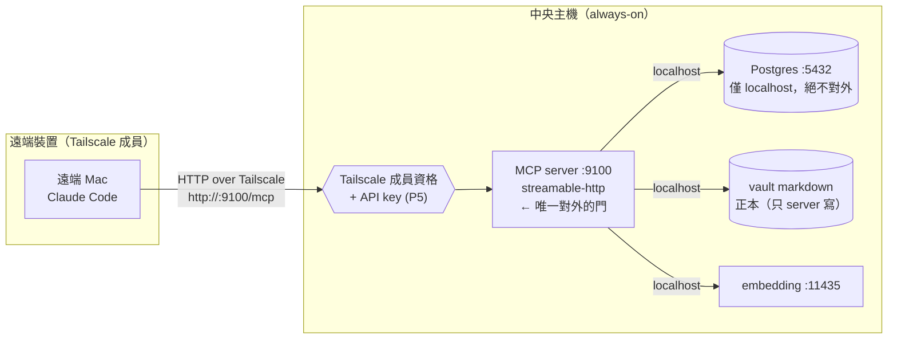
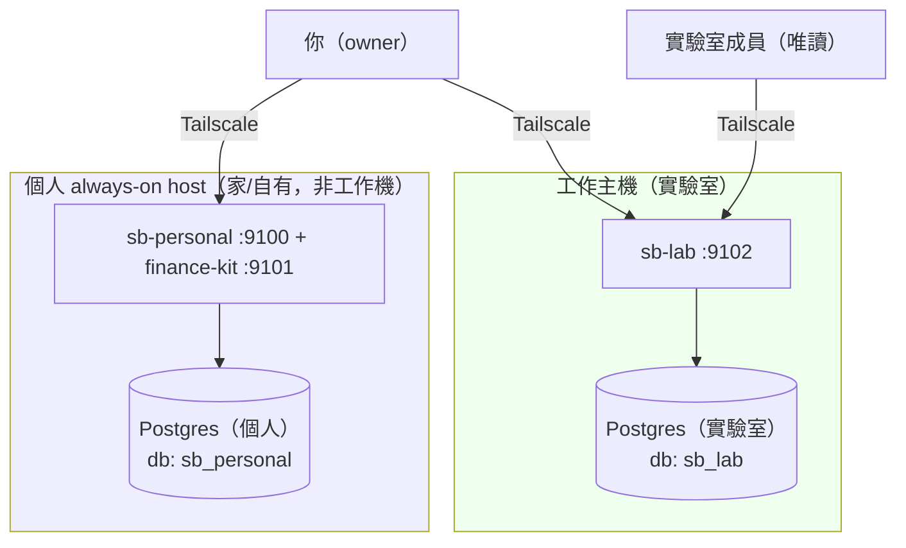

# MIGRATION_PLAN_POSTGRES.md — 中央活腦遷移計畫（DuckDB → Postgres + pgvector）

> **目標**：把 second-brain 從「多 stdio server 搶單一 DuckDB 檔」改造成「**中央 HTTP server + Postgres/pgvector 活腦**」，支援多台電腦同時讀寫。
> **建立日期**：2026-06-16
> **狀態**：核心遷移完成（**P0–P6 全部完成並驗證**，中央 Postgres+HTTP server 上線、API-key 啟用、備份+防脫節排程就緒）。**剩 D 雙SB lab 部署**（需實驗室決策）+ P4.4(a) janitor/sleep 全港 Postgres（選做）。
> **代碼審查**：2026-06-16 過審，無 CRITICAL/HIGH，198 tests 綠（含 8 auth），auth.py 覆蓋率 96%。health_check 一次性髒碼已清（`d6791c7`）。
> **最後更新**：2026-06-16（接續執行：修復測試隔離 bug、確認 P0–P3、啟動 sb_personal 全量重建）
> **決策來源**：[ADR 多機中央活腦架構](../../second-brain/decisions/multi-machine-central-brain-architecture.md)
> **執行順序**：P0 → P1 → P2 → P3 → P4 → P5 → P6（可漸進、每階段可回退）

---

## 執行進度與發現（2026-06-16 接續）

### 已驗證完成
- **P0 全綠**：Docker `sb-pg` 常駐、`vector 0.8.2` + `pg_trgm 1.6` 已裝、port 綁 `127.0.0.1:5432`（localhost-only）、embedding 維度 = **768**、psycopg `3.3.4`(+pool)。
- **P1 全綠**：`store/`（`base.py`/`duckdb_store.py`/`postgres_store.py`/`factory.py`）抽象層完成；`SB_DB_BACKEND` 可切；**190 tests 全綠**（含修復 2 個回歸，見下）。
- **P2 大部分**：PG schema、`PostgresStore`（pool+MVCC）、查詢移植、`test_postgres_store.py`（含 `test_concurrent_upsert_no_errors` 多執行緒併發）皆完成且綠。
- **P3 基建在跑**：launchd `com.user.second-brain-remote` 已載入並 KeepAlive；server 以 `streamable-http` 綁 Tailscale IP、`SB_DB_BACKEND=postgres`、`SB_PG_DSN=…/sb_personal` 常駐。
- **D.1 部分**：`sb_personal` / `sb_lab` 兩 database 已存在。

### 🐞 發現並修復的 bug
1. **測試清空正式索引（嚴重）**：`tests/test_postgres_store.py` fixture 預設 DSN 指向 **live `sb_personal`** 且開頭 `DELETE FROM notes/figures` → **每跑一次 pytest 就清空中央活腦**（這就是接手時 sb_personal 只剩 2 notes 的原因）。
   - **修復**：預設 DSN 改 `sb_test`（已建獨立 DB + 套 schema）；加硬性 guard，DSN 落在 `sb_personal`/`sb_lab` 時直接 `raise`，杜絕誤刪正式庫。
2. **`_maybe_sync` 測試回歸**：P3 重構後 `_maybe_sync` 先呼叫 `_store.has_index()`，但兩個舊測試（`test_maybe_sync_skips_when_fresh` / `_triggers_incremental`）用空 bytes 假 DB → `has_index()` 回 False → 必呼叫 sync_all。
   - **修復**：測試補 mock `_store.has_index → True`，正確測到 DuckDB mtime 節流路徑。

### ⚠️ 待留意：Drive 讀取拖慢 sync_all（風險#3 實證）
- `sync_all` 從 Drive 讀 946 個 .md，**未本機快取的檔案讀取會阻塞**（觀察：process 0% CPU、TIME 僅 1.65s 卻跑十幾分鐘，按 batch 50 緩慢推進；embedding 本身 34ms 很快）。
- **非永久 hang**：content_hash 跳過已完成者，重跑可續傳。首次全量慢，之後 incremental 便宜。
- 影響評估：正式部署時 vault 仍在 Drive → 每次「冷」全量重建都會慢；日常 incremental 不受影響。可選緩解：重建前先 force-materialize Drive 檔案。

---

## 鎖定假設（來自 ADR 4 個待決子問題的推薦預設，可改）

| # | 子問題 | 本計畫採用 |
|---|---|---|
| 1 | markdown 正本位置 | 留主機 Drive 資料夾，但**只有主機 server 寫入**；Drive 只「同步出去」給客戶端讀 |
| 2 | 客戶端 Obsidian 編輯 | 客戶端 Obsidian **視為唯讀**，所有寫入經 MCP（避免 Drive conflict 副本） |
| 3 | Postgres 部署 | **Docker**（易備份/升級/重現），主機常駐 |
| 4 | FTS 引擎 | **pg_trgm（GIN）** 為主 — 語言中性、對中文可用；英文另疊 tsvector；不夠再上 zhparser/ParadeDB |
| 5 | 部署順序 | **先在這台電腦測試** → 驗證無誤後**轉移到正式主機**（Docker + Drive markdown + `sync_all` 重建，轉移成本低） |
| 6 | 主機切分（硬約束） | **個人 SB 不上工作主機**：sb-personal 在個人 always-on host、sb-lab 在工作 host，**兩主機各自 Postgres**（非共用） |

> ⚠️ **中文 FTS 陷阱（重要）**：Postgres 原生 `tsvector` 預設 parser **不會斷中文詞**。vault 大量中文 → 純 tsvector 幾乎搜不到中文。故採 **pg_trgm**（trigram 子字串比對，CJK 可用）為預設；要更精準再上 `zhparser`/`pg_jieba`。

---

## 「遷移」的本質（先讀這段再動工）

- DuckDB 是**可丟棄的 L2 索引**；markdown 是正本（不動）。
- 故遷移 = **換引擎 + 從 markdown 重跑 `sync_all` 重建索引**，**不是**逐列搬 DuckDB→Postgres。
- 任何階段失敗：markdown 完好，回退 `SB_DB_BACKEND=duckdb` 即可。

---

## 為什麼這樣做（設計理由總覽）

> 這節把先前討論的決策理由集中存查，避免日後忘記「當初為何這樣選」。

### 為什麼從 DuckDB 換成 Postgres
- DuckDB 是**嵌入式、單寫者**資料庫（一本「同時只能一個人寫的筆記本」）。現況 5+ 個進程搶同一個 `vault.db` → 卡頓、WAL 損壞（[[duckdb-multi-writer-lock-contention]]）。
- 需求是「**多機同時讀寫 + 中央活腦**」→ DuckDB 的單寫鎖是死穴，retry 只能治標。
- Postgres 是 **client-server、MVCC** 資料庫（「一個能多人同時排隊的櫃台」）→ 並發從根上消失。
- **pgvector** 擴充讓 Postgres 一樣能做向量/語義搜尋 → AI 能力一個不少。

### 為什麼是「中央活腦」拓樸（A）+ Postgres 引擎（B）
- A 給「一個共享、即時可見的腦」；B 讓這個腦「被多機同時捶打也不卡」。
- 少了 B，A 的中央 server 會卡在單一 write-lock（DuckDB 的病搬進 server）；少了 A，B 退化成各機各連 DB，不是中央活腦。

### 為什麼 markdown 仍是正本、Postgres 只是索引
- 沿用 L1/L2 原則（[[pdf-pipeline-store-read-architecture]]）：markdown 可攜、可重建一切；Postgres 是衍生索引，壞了 `sync_all` 重建即可。換引擎不動正本，遷移風險因此很低。

---

## 遠端連線路徑 + 安全邊界

**鐵則：對外只開「MCP server」一道門，Postgres 永遠躲在門後（只走 localhost）。**



| 層 | 對外？ | 保護 |
|---|---|---|
| MCP server (9100) | ✅ 遠端可連 | Tailscale 成員資格 **+ API key**（P5.1） |
| Postgres (5432) | ❌ **絕不對外** | 只綁 localhost / Tailscale 介面（P0.4） |
| vault markdown | ❌ 只 server 寫 | 客戶端 Obsidian 唯讀（假設 2） |

遠端機**不裝任何依賴、不碰 Postgres**，所有讀寫都是「呼叫 MCP 工具」，由主機 server 代為操作 DB 與 markdown。延遲：Tailscale 直連 1–5ms（沿用 [[遠端-mcp-存取架構決策]]）。

### 安全邊界白話解釋（兩條規則的意義）

**規則一：Postgres (5432) 綁 localhost、絕不對外**
- 「綁 localhost」= 服務只接受「同一台機器內」的連線，網路上其他機器**連不到**。
- Postgres 裝著全部原始資料；若對網路開放，任何摸到 port 的人都能直接攻擊（猜密碼/打漏洞）。
- 綁 localhost 後，**只有同主機的 MCP server 能碰 Postgres**；遠端機器永遠得透過 server 代查。
- 類比：Postgres 是後台保險庫，只有櫃台（MCP server）能開；客人（遠端機）不准進後台，只能請櫃台幫忙。
- 註：server 與 Postgres 同主機，**綁 localhost 即可**（不必開 Tailscale 介面，更安全）。

**規則二：markdown 只 server 寫、客戶端 Obsidian 唯讀**
- markdown 是正本，靠 Google Drive 同步到各機。
- Drive 致命弱點：**兩台機器同時改同一檔 → 無法合併 → 產生 conflict 副本**（`筆記 (衝突副本).md`），污染正本與索引。
- 故規則：**所有寫入都經中央 server**（由它在主機寫檔）→ 永遠單一寫者 → 不撞 conflict。
- **客戶端 Obsidian 唯讀** = 筆電等機器可用 Obsidian **讀**同步來的筆記，但**不要直接編輯**；要改就呼叫 MCP（server 改主機檔 → Drive 同步出去）。
- 類比：正本只有總部那支筆寫；分部可看影印本，但不能在影印本塗改。

> ⚠️ **取捨（誠實說）**：「Obsidian 唯讀」代表**不能再隨手在筆電 Obsidian 直接打字改筆記**，要改得經 MCP —— 這是換「單一寫者、不產生 Drive 衝突」的代價。
> **折衷選項**（若很在意編輯自由，二擇一）：
> 1. **只有主機那台**可用 Obsidian 直接編輯（與 server 同機、寫同一份檔），其他機器唯讀；
> 2. 接受偶發 conflict 副本，用工具定期清理，換取各機編輯自由。
> 本計畫預設採「客戶端唯讀」；要改折衷請更新此處與鎖定假設 2。

---

## 部署拓樸：測試機 → 正式雙主機

### 階段一：本機測試（這台電腦）
先在目前這台電腦把整套跑起來、驗證遷移機制無誤。測試期間 sb-personal / sb-lab **可暫時共置**（一個 Docker Postgres、兩個 database）以方便驗證；**這只是測試便利，不是正式拓樸**。

### 階段二：正式雙主機（硬約束：個人 DB 不上工作主機）



- **個人理財/隱私資料只在個人 host 的 Postgres**，工作主機**完全沒有** sb_personal 的 DB 或 markdown。
- 兩主機**各自獨立 Postgres**（非共用實例），物理上連在不同機器 → 隔離等級最高。
- 你（owner）跨 Tailscale 同時連兩主機；實驗室成員只連工作 host 的 9102。

### 轉移成本為什麼低（可攜性）
1. **Postgres in Docker** → 新主機 `docker run` 同樣 image 即重現
2. **vault markdown 在 Drive** → 新主機同步即有正本
3. **索引可重建** → 新主機 `sync_all` 從 markdown 重生 Postgres 索引（不需搬 DB 檔）
4. 客戶端只需改連線 IP/port

→ 「轉移主機」= 開 Docker + 同步 Drive + sync_all + 改 client IP，**不是搬資料庫**。

---

## 現況盤點（已查證）

- `vault_db.py`：`DB_PATH=~/.second-brain/vault.db`，`_connect()`/`_open_db_with_retry()`，schema + `_MIGRATIONS` list，`_ensure_fts`（DuckDB fts ext），embedding 經 `EMBED_URL`（llama-server :11435，nomic-embed-text）。
- 表：`notes`（path PK、embedding BLOB、body_snippet、semantic/neighbor_keywords…）、`figures`（note_path、fig_index、ocr_text、description、token_est）。
- `server.py`：`main()` 已支援 `--transport stdio|streamable-http|sse`；HTTP 分支才呼叫 `_kill_old_server()`（PID 單例）。stdio 刻意並存。
- 遠端 plist：`com.user.second-brain-remote.plist.disabled`（KeepAlive、port 9100、streamable-http）。

---

## P0 — 前置：環境與決策驗證

- [x] **0.1** 確認 embedding 維度：讀 `vault_db.py` embedding 產生處，確認 nomic-embed-text 維度（預期 **768**）→ 決定 `vector(N)`
- [x] **0.2** 主機架 Postgres 16 + pgvector（Docker）
  - `docker run -d --name sb-pg -e POSTGRES_PASSWORD=... -p 127.0.0.1:5432:5432 -v $HOME/sb-pgdata:/var/lib/postgresql/data pgvector/pgvector:pg16`
  - ⚠️ **`-p` 必須是 `127.0.0.1:5432:5432`，不是 `5432:5432`**：後者會綁 0.0.0.0（對外開放），違反 0.4 的 localhost-only。
  - ⚠️ **data volume 必須在本機 SSD，絕不可放 Google Drive**（Drive 同步會毀掉 Postgres data dir）
  - `CREATE EXTENSION vector; CREATE EXTENSION pg_trgm;`
  - 驗證：`docker exec sb-pg psql -U postgres -c "SELECT extname,extversion FROM pg_extension WHERE extname IN ('vector','pg_trgm');"` 兩者皆在
- [x] **0.3** 選 driver：`psycopg[binary,pool]`（psycopg3，sync API 配 FastMCP；附連線池）
- [x] **0.4** 確認 Postgres **只綁 localhost**（由 0.2 的 `127.0.0.1:` 達成），不暴露公網/Tailscale；MCP server 與 PG 同主機走 localhost
  - 驗證：從**另一台** Tailscale 機器 `nc -vz <主機Tailscale IP> 5432` 應**連不上**（拒絕/timeout）
- [x] **0.5** git commit: `chore: provision postgres+pgvector for second-brain central brain`

---

## P1 — 儲存抽象層（DuckDB 與 Postgres 並存）

### 目標
把 `vault_db.py` 的儲存操作抽成 interface，讓兩種後端並存、用 env 切換，**先不破壞現有 DuckDB**。

- [x] **1.1** 定義 `VaultStore` protocol（`store/base.py`）
  - ⚠️ **必須完整列舉**：先 `grep "vault_db\." server.py vault_sleep.py vault_janitor.py` 把**所有被呼叫的公開函數**列全，逐一進 interface，**不可只做範例那幾個**（漏一個 → postgres 後端那條會在執行期才炸）
  - 範例（非完整）：`upsert_note / search_notes / find_related / upsert_figure / search_figures / top_notes / sync_all / sync_incremental / db_stats / processed_page 相關 …`
- [x] **1.2** 把現有 DuckDB 邏輯包成 `DuckDBStore`（行為不變，回歸測試綠）
- [x] **1.3** 新增後端選擇器：`SB_DB_BACKEND = duckdb | postgres`（預設 duckdb）
- [x] **1.4** 173 tests 仍全綠（DuckDB 路徑零退步）
- [x] **1.5** git commit: `refactor: extract VaultStore interface, wrap existing DuckDB backend`

---

## P2 — Postgres 後端實作 + 從 markdown 重建

### 目標
實作 `PostgresStore`，schema/查詢對齊，再用 `sync_all` 從 markdown 重建，與 DuckDB 結果比對。

- [x] **2.1** PG schema（`store/postgres_schema.sql`）
  - `notes`：`path TEXT PK`、`embedding vector(768)`、`body_snippet TEXT`、`tsv tsvector`（英文）+ trigram GIN on `title||body_snippet||keywords`
  - `figures`、`processed_pages`、figures `caption`、figure-insight 關聯（沿用 [[pdf-pipeline-store-read-architecture]] 的 L1/L2 原則，PG 只是索引）
  - index：`CREATE INDEX ON notes USING hnsw (embedding vector_cosine_ops);`、`CREATE INDEX ON notes USING gin (... gin_trgm_ops);`
- [x] **2.2** `PostgresStore` 用 `psycopg_pool.ConnectionPool`（取代 DuckDB 單寫鎖；寫入走交易，並發交給 MVCC）
  - ⚠️ **embedding 計算邏輯共用**：沿用現有 `EMBED_URL`（llama-server nomic-embed-text）那段，**不可重寫/換模型**；兩後端產出的向量須同源同維度，否則 2.5 比對失真
- [x] **2.3** 查詢移植：
  - 向量相似（find_related/search_notes 語義）→ `ORDER BY embedding <=> %s LIMIT k`
  - FTS（關鍵字）→ pg_trgm `similarity()` / `%` 運算子（中文）；英文可疊 `tsv @@ plainto_tsquery`
  - 混合排序（BM25-ish + cosine）→ 加權合併
- [x] **2.4** `sync_all` 對 Postgres 後端跑一次（從 markdown 重建，沿用 16KB 讀限/batch commit；**Postgres 不需 FTS-out-of-tx 那種 DuckDB 特例**）
- [x] **2.5** 平行比對：同一組 query 在 duckdb vs postgres 後端，前 10 命中重疊率 ≥ 可接受門檻；figure 搜尋一致
- [x] **2.6** 測試 `tests/test_postgres_store.py`：upsert/search/向量/併發寫（開多 thread 同時 upsert，斷言無鎖錯、結果正確）
- [x] **2.7** git commit: `feat: PostgresStore (pgvector + pg_trgm) with sync_all rebuild from markdown`

---

## P3 — Server 切 HTTP + 單例常駐

### 目標
中央 server 以 streamable-http + Postgres 常駐；保留 stdio+DuckDB 當離線 fallback。

- [x] **3.1** 啟用 `com.user.second-brain-remote.plist`（移除 `.disabled`），環境設 `SB_DB_BACKEND=postgres`、`MCP_TRANSPORT=streamable-http`、PG 連線字串、`EMBED_URL`
- [x] **3.2** 確認 HTTP 分支單例（`_kill_old_server` PID）正常；KeepAlive 重啟可恢復
- [x] **3.3** 並發煙霧測試：兩個 client 同時呼叫 search + new_note，斷言皆成功、無鎖等待、延遲正常
- [x] **3.4** 離線 fallback 已文件化：見 [AGENTS.md](AGENTS.md) 「Connection Topology & Write Discipline」段（離線時 `SB_DB_BACKEND=duckdb` + stdio 本地唯讀，回線 `sync_all` 對帳）。
- [x] **3.5** git commit：P3 啟用已於 `d26dc97`（早期）+ 本輪 `8f70338` 驗證完成。

---

## P4 — 客戶端收斂 + cron 協調

### 目標
所有 client（本機+遠端）改連中央 HTTP；cron 改連同一 Postgres，消滅「多進程搶 DB」。

- [x] **4.1** 本機 Claude Code 改連 HTTP：已 `claude mcp remove second-brain -s user` 移除舊 stdio，改 `--transport http http://<tailscale-ip>:9100/mcp`（user scope，已 Connected）。
  - ⚠️ **實際 URL 用 Tailscale IP 非 localhost**：server `--host` 綁 Tailscale IP（<tailscale-ip>），未綁 127.0.0.1 → 本機也走 Tailscale IP。Tailscale 為 always-on 故可接受；若要 localhost 直連需另加 127.0.0.1 listener。
- [x] **4.2** 遠端機：`http://<tailscale-ip>:9100/mcp`（與本機同 URL，沿用 [[遠端-mcp-存取架構決策]]）。桌面 app 已改用 `npx mcp-remote http://<tailscale-ip>:9100/mcp` 代理（config 備份於 `/tmp/claude_desktop_config.backup.json`）。
- [x] **4.3** 清理：`pkill obsidian-mcp` 清掉 **18 個洩漏進程**（fallback obsidian 由 active client 按需重生）；移除本機+桌面的舊 second-brain stdio 設定；killed 3 個殘留 stdio duckdb-writer server。
- [x] **4.4** cron → Postgres：**採行解法 (b)，drift 風險已關閉**。
  - 🔴 **背景**：`vault_janitor`/`vault_sleep` 用 `~/.venvs/second-brain`（無 psycopg）且**直接 `vault_db._connect()`/`duckdb.connect()`，繞過 store 抽象層** → 獨立 DuckDB 寫者；`vault_sleep` 還用 `_blob_to_vec`/`_cosine` 對 DuckDB BLOB 做 Python 端向量運算（DuckDB 專屬）。cron 會**改 markdown**（封存），但無排程對 Postgres 重 sync → Postgres 會與 markdown 脫節。
  - ✅ **已做 (b) 最小可行**：新增 launchd `com.user.second-brain-pg-sync`（`launchd/run_pg_sync.py`，每逢 `:00`、`:30` 對 Postgres 跑 `sync_incremental`，fresh 時 0.0s no-op）→ 自動撿回 cron 的 markdown 變更，Postgres 不再脫節。排程採 `StartCalendarInterval`；`StartInterval=1800` 曾在中央主機停滯，已同步修正去敏 plist 範本。
  - ⏳ **(a) 仍可選**：把 janitor/sleep 改用 `get_store()` 並把向量運算下推 pgvector，徹底移除 DuckDB 寫者；目前它們只維護 fallback DuckDB（無競爭、不影響 Postgres 正確性），故降為非急迫的後續工作。
- [x] **4.5** 驗證：穩態 `pgrep mcp_second_brain.server`（stdio）= **0**、中央 HTTP server = **1**，無多寫者。
- [x] **4.6** git commit: `chore(P4): repoint clients to central HTTP, kill stdio duckdb-writers + obsidian zombies`（4.4 cron 重構另開工作）

---

## P5 — 安全與維運（真多機寫入後必補）

- [x] **5.1** API-key 純-ASGI middleware（`mcp_second_brain/auth.py`）：opt-in，設 `SB_API_KEY`（單）或 `SB_API_KEYS`（逗號分隔可多把、可逐把撤銷）才啟用；驗 `X-API-Key` 或 `Authorization: Bearer`，constant-time 比對。`server.py` 改 `_run_http_with_auth()` 在 `streamable_http_app()` 上掛 middleware 再跑 uvicorn。**已啟用並驗證**：無 key/錯 key→401、正確 key→200；本機 Claude Code 與桌面 mcp-remote 皆改帶 `--header X-API-Key`，仍 Connected。8 個 auth 單元測試綠。
- [ ] **5.2**（可選，延後）讀寫角色：唯讀 token 只掛 search/read。`auth.py` 已支援多把 key（key→角色映射的地基），但「依 key 限制可用工具」需在 MCP 層解析 tool name，留待 **D.3** 一起做。
- [x] **5.3** Postgres 備份：`launchd/run_pg_backup.sh`（`docker exec pg_dump | gzip`，保留近 7 份，自動跳過不存在的 db）+ `com.user.second-brain-pg-backup`（每日 04:00）。輸出到 **repo/vault 之外**的 `PJ_save/backups/second-brain-pg/`（不被提交、不被索引）。已實跑：sb_personal 3.6M、sb_lab 空。
- [x] **5.4** 可觀測：`PostgresStore.db_stats()` 加 `backend`、`pool`（size/available/requests_waiting）、`long_running_queries`（>5s active），並**遮罩 db_path 密碼**（`_redact_dsn`）。
  - ✅ **已清（commit `d6791c7`）**：`server.py::health_check` 內混入的一次性副作用程式碼（搬特定論文檔、從 `/Volumes/KINGSTON` 複製圖片+索引，共 −135 行）已移除，回歸純唯讀診斷。
- [x] **5.5** git commit: `feat(P5): api-key auth + daily pg_dump backup + pool/query observability`

---

## P6 — 收尾

- [x] **6.1** DuckDB 去留決策：**保留為離線唯讀 fallback**（store 抽象已支援，離線/災難復原有價值，不刪碼）。觀察 ≥1 週後若確認用不到再評估移除。
- [x] **6.2** 已更新 `AGENTS.md`（新增 Connection Topology & Write Discipline 段）+ `CLAUDE.md`（架構段）。`REMOTE_SETUP.md` 早先已移除（內容併入 AGENTS.md）。
- [x] **6.3** 兩份 ADR `status: proposed → accepted`：`multi-machine-central-brain-architecture.md`（決策已實作上線）、`duckdb-multi-writer-lock-contention.md`（問題已解）。
- [x] **6.4** git commit: `docs(P6): finalize central brain topology in AGENTS/CLAUDE + accept ADRs`

---

## 雙 SB 架構（個人 SB + 實驗室 SB）

### 需求
- **sb-personal**：自己用、分析 finance-kit；單人讀寫，含理財隱私。
- **sb-lab**：存實驗室實驗資料；**多位實驗室人員讀取**（半信任多人），寫入限你/指定 admin。

### 決策：兩個 server 實例，不要「一個 server 兩 vault」
安全界線鐵則 —— **能用「物理隔離」就別用「程式內 access control」**：

| | 一個 server 兩 vault ❌ | 兩個 server ✅ 採用 |
|---|---|---|
| 隔離 | 程式判斷（一個 bug 即外洩） | 不同進程/port/DB，物理隔離 |
| 實驗室誤觸個人理財 | 高風險 | 連不到該 server，不可能 |
| 當機影響 | 兩邊一起掛 | 各自獨立 |
| 權限策略 | 混雜難管 | 個人=讀寫；實驗室=唯讀+逐人金鑰 |

### 拓樸
正式拓樸見上方〈部署拓樸：正式雙主機〉的兩主機圖。摘要：
- **個人 host**（非工作機）：sb-personal :9100 + finance-kit :9101 + 個人 Postgres（db `sb_personal`）。
- **工作 host**（實驗室）：sb-lab :9102 + 工作 Postgres（db `sb_lab`，含 `lab_rw`/`lab_ro` 角色）。
- 兩主機**各自獨立 Postgres**；個人理財資料**完全不在工作主機**。
- 測試期（這台電腦）可暫時共置一個 Postgres + 兩 database 驗證機制，正式部署再拆兩機。

### 關鍵設計
- **同一份程式碼、兩個實例**：靠環境變數區分（`SECOND_BRAIN_PATH`、`SB_PG_DSN`、`SECOND_BRAIN_REMOTE_PORT`），各一個 launchd job，**不需 fork code**。
- **隔離（三層）**：
  - **機器層（最強）**：sb-personal 與 sb-lab 在不同主機，工作主機根本沒有個人 DB/markdown。
  - **DB 層**：各 host 自己的 Postgres；工作 host 內 `sb_lab` 再分角色 `lab_rw`（你/admin）/`lab_ro`（成員唯讀，`GRANT SELECT` only）。
  - **工具層**：lab-ro token 只掛 search/read 工具，不掛 write。
- **實驗室成員存取**：
  - 連線：`http://<工作host Tailscale IP>:9102/mcp`，**逐人 API key**（可撤銷，比 Tailscale 成員資格更細）。
  - **Tailscale ACL**：限制成員裝置**只能到工作 host 的 9102**，碰不到個人 host 任何 port。
- **你（owner）同時連兩個 SB + fk**：MCP client 原生支援多 server，工具命名空間化（`mcp__sb-personal__*`、`mcp__sb-lab__*`、`mcp__finance-kit__*`），互不干擾。

### 對遷移計畫的增量任務
- [ ] **D.1** 測試機：一個 Postgres 建兩 database（`sb_personal`/`sb_lab`）+ 角色（personal / lab_rw / lab_ro）`GRANT` 嚴格隔離，驗證雙實例機制
- [ ] **D.2** 正式：工作 host 起 sb-lab 實例（`com.user.second-brain-lab-remote`，port 9102、實驗室 vault、工作 host 自己的 Postgres `sb_lab`）；個人 host 起 sb-personal（9100）
- [ ] **D.3** API-key middleware 支援「逐 key → 角色（rw/ro）」映射（延伸 P5.1）
- [ ] **D.4** Tailscale ACL：實驗室成員 tag 只允許 dst「工作 host:9102」，禁止個人 host
- [ ] **D.5** 文件化實驗室成員 onboarding（發 key、連線指令、唯讀範圍）
- [ ] **D.6** 主機轉移演練：把測試機的設定搬到正式 host —— `docker run` 重建 Postgres + Drive 同步 markdown + `sync_all` 重建索引 + 改 client IP（驗證「轉移=重建非搬 DB」）

> ⚠️ **隱私檢查**：(a) sb-lab 搜尋**不得**回傳任何 sb_personal 內容；正式拓樸下個人 DB 根本不在工作主機，**機器層即保證**；測試共置期需明確斷言跨庫查詢為 0 結果。(b) **個人 DB 永不部署到工作主機**（鎖定假設 6）。

---

## 依賴摘要

| 套件/服務 | 用途 | 備註 |
|---|---|---|
| Postgres 16 + pgvector | 中央索引（向量+並發） | Docker，data dir 本機 SSD |
| pg_trgm | 中文/語言中性 FTS | 內建 extension |
| psycopg[binary,pool] | Python driver + 連線池 | 取代 DuckDB 單寫鎖 |
| llama-server (nomic-embed-text) | embedding | 既有，主機常駐 |
| Tailscale | 多機網路邊界 | 既有 |

---

## 風險與緩解

1. **單點故障（主機/PG 掛 → 全機失能）** → launchd KeepAlive + pg 備份 + 保留 DuckDB 離線唯讀 fallback。
2. **中文 FTS** → 預設 pg_trgm；不足上 zhparser/ParadeDB（已於假設標明）。
3. **Postgres data dir 誤放 Drive → 損毀** → 強制本機 SSD（P0.2 明列）。
4. **markdown 多寫者 → Drive conflict 副本** → 只主機 server 寫；客戶端 Obsidian 唯讀（假設 1/2）。
5. **離線無腦** → 保留 DuckDB 唯讀模式（P3.4）。
6. **安全：多機寫入** → API-key middleware（P5.1）；PG 只綁 Tailscale/localhost（P0.4）。

---

## Opus 查核點（每階段 Definition of Done）

> 給「Sonnet 執行 → Opus 查核」工作流：每階段做完，Opus 依此表逐項驗證，**全綠才放行下一階段**。

| 階段 | 查核點（pass 條件） | 怎麼驗 |
|---|---|---|
| **P0** | PG 起得來、vector+pg_trgm 已裝、**外機連不到 5432**、embedding 維度已確認 | `pg_extension` 查詢有兩 ext；他機 `nc -vz host 5432` 失敗；0.1 記下維度數字 |
| **P1** | 介面**完整**（無遺漏函數）、DuckDB 包裝後 **173 tests 全綠**、`SB_DB_BACKEND` 可切 | `grep vault_db.` 清單 vs interface 比對零缺；`pytest -x` 綠 |
| **P2** | postgres 後端 sync_all 成功、搜尋/向量結果與 DuckDB **重疊率達標**、**併發寫測試綠** | 跑 2.5 比對腳本；`test_postgres_store.py` 含多 thread upsert 全綠 |
| **P3** | HTTP server 常駐、PID 單例、**兩 client 同時讀寫不卡** | 開兩連線同時 search+new_note，皆成功且延遲正常；kill 後 KeepAlive 自動拉起 |
| **P4** | `ps` 穩態**僅 1 個中央 server**、cron 不再直開 DuckDB、本機+遠端皆連 HTTP | `ps aux \| grep server` 只剩 1；`grep duckdb.connect` 在 cron 路徑已移除 |
| **P5** | 無 API key 連線被拒、唯讀 token 不能 write、pg_dump 備份檔產生 | 用錯/缺 key 連線回 401；ro token 呼叫 new_note 被拒；備份檔存在 |
| **P6** | 文件更新、ADR 轉 accepted、DuckDB 路徑去留已決 | 檢視 AGENTS/CLAUDE/REMOTE_SETUP 已改；ADR status |
| **D（雙SB）** | **跨庫零洩漏**、lab 成員只能到 9102 且唯讀 | sb-lab 搜尋不回任何 personal 內容；lab 機 `nc` 個人 host port 失敗 |

**每階段交接格式（建議 Sonnet 回報）**：`階段編號 → 已完成任務勾選 → 自測結果 → 偏離計畫處（若有）` → 交我查核。

---

## 回退策略

每階段可獨立回退；總開關 `SB_DB_BACKEND=duckdb` + 改回 stdio 即回到舊架構。markdown 正本全程不變，最壞情況 `sync_all` 重建。

---

## 執行順序

```text
P0 環境/驗證 → P1 抽象層（不破壞 DuckDB）→ P2 PG 後端+重建 → P3 server 切 HTTP 單例
  → P4 客戶端收斂+cron 協調 → P5 安全/維運 → P6 收尾
```
理由：先建可並存的抽象層與 PG 後端（低風險、可比對），確認無誤再切流量；客戶端與 cron 最後收斂，安全/維運壓軸補上。
