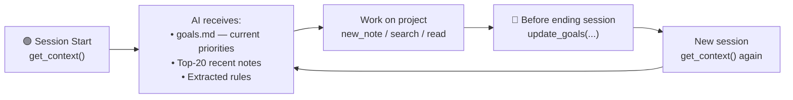

# second-brain MCP Server

<!-- mcp-name: io.github.ddmanyes/mcp-second-brain -->

**A self-maintaining personal knowledge database — powered by MCP, DuckDB, and biological memory models.**

[](https://github.com/ddmanyes/second-brain-mcp/actions/workflows/ci.yml)
[](https://www.python.org/)
[](https://duckdb.org/)
[](https://modelcontextprotocol.io/)
[](LICENSE)

---

> **For anyone who saves more papers, notes, and figures than they could ever re-read.**
> second-brain turns everything you capture into a database that *maintains itself* — auto-linking related notes, compressing what you stop reading, and keeping every figure searchable by its content. What you saved a year ago is still one query away, at a fraction of the token cost.

## Why Does This Exist?

| Problem | Solution |
| :------ | :------- |
| 📄 You save dozens of papers but can never find the right figure | `search_figures("UMAP melanocyte")` — returns the exact panel, across every paper you've saved |
| 📑 arXiv gives you the abstract; you need the full paper | Auto-upgrades `/abs/` → `/html/` — fetches the complete paper with all sections, not just the abstract |
| 🗂 Notes pile up; older ones never get cleaned up | **Vault Sleep**: low-access notes compress automatically every Sunday while you sleep (60–90% token reduction) |
| 🔗 New notes stay isolated; you forget what's connected | **Auto-wikilinks**: every saved note is automatically linked to semantically related notes already in your vault |
| 🔎 Semantic search needs a cloud API or Docker stack | Self-hosted `nomic-embed-text` via llama-server; BM25 fallback when offline |
| 🔒 Every AI memory tool locks you into their format | Pure Markdown vault — sync with Google Drive, iCloud, or git; switch agents anytime |
| 🖼 Figure context is lost when you read a paper | Every figure is downloaded, OCR'd by Claude Vision, and stored in DuckDB — searchable by gene name, p-value, axis label |

---

## The One-Command Demo

```text
save_article("https://arxiv.org/abs/2405.01234")
  ↓
• /abs/ auto-upgraded to /html/ — full paper, not just abstract
• Full text converted to Markdown
• All figures downloaded + OCR'd by Claude Vision
• Semantic embeddings computed
• Auto-linked to related notes already in your vault   ← auto-wikilinks
• Stored in 30-resources/ — queryable immediately

search_figures("UMAP cluster batch correction")
  ↓
• Returns the exact figure from the exact paper
• Works across your entire saved literature library
```

---

## What Makes It Different


**Eight things most self-hosted memory tools can't do — combined in one:**

| Most memory tools… | second-brain |
| :----------------- | :----------- |
| Save a link or PDF, then leave you to read and tag it | 🔬 **One command builds the database** — `save_article` fetches any URL/PDF, converts to Markdown, downloads & OCRs every figure with Claude Vision, then semantic-indexes it |
| Store the arXiv *abstract* you pasted | 📑 **Full text, not abstracts** — `/abs/` URLs auto-upgrade to `/html/` for the complete paper: methods, results, discussion |
| Leave new notes isolated until you tag them | 🔗 **The knowledge graph builds itself** — every note is auto-linked to semantically related notes already in your vault |
| Cost the same whether a note is read daily or never | 🧠 **Memory that forgets like a brain** — Ebbinghaus score ranks by recency × frequency; stale notes compress while you sleep |
| Search *documents*, not what's inside the figures | 🖼 **Figure-level search across your whole library** — `search_figures("p < 0.001")` returns the exact panel from the exact paper |
| Forget your project decisions between sessions | 📋 **The AI learns your rules** — hot notes auto-extract constraints into `memory/rules.md`, injected at every session start |
| Grow more expensive as the vault grows | 📉 **Token cost shrinks with age** — PNG snapshots replace old text at 60–90% compression; frequently-read papers stay full-fidelity |
| Lock you into their database format | 🔓 **Zero lock-in** — pure Markdown, any MCP agent, sync via any cloud drive or git |

---

## Cross-Session Continuity — Pick Up Where You Left Off

Every project you work on can be resumed in a new session with full context — no re-explaining, no lost progress.



### How It Works in Practice

**End of session** — tell the agent to save state:

```text
Update goals: currently working on the scRNA batch correction pipeline.
Completed: harmony integration. Blocked on: choosing n_components for PCA.
Next session: start from the PCA parameter sweep in 20-areas/research/harmony-notes.md
```

The agent calls `update_goals()` and optionally `new_note("project", ...)` for detailed progress.

**Start of next session** — just say:

```text
Get context and continue where we left off.
```

The agent calls `get_context()` and immediately sees:

- `goals.md` with the state you saved
- The harmony-notes.md surfaced at the top (recently accessed, high Ebbinghaus score)
- Rules auto-extracted from that note, e.g.:

```text
RULE: use n_components=30 for this dataset — tested 20/30/50, 30 minimises batch effect without losing resolution
RULE: exclude sample CRC_04 — library size outlier confirmed by QC
```

These rules live in `memory/rules.md` and are injected at every `get_context()` call — the AI carries your hard-won decisions forward automatically, without you having to repeat them.

### What Gets Persisted

| What | Where | Always in context? |
| :--- | :---- | :----------------: |
| Current priorities / blocked items | `memory/goals.md` | ✅ every session |
| Project progress notes | `10-projects/` or `20-areas/` | ✅ if recently accessed |
| Decisions and rationale | `decisions/` | via `get_decisions()` |
| Extracted rules from notes | `memory/rules.md` | ✅ every session |
| Saved papers and figures | `30-resources/` | via `search_notes/figures` |

> **This works across any project** — bioinformatics analysis, coding, writing, research. Save state with one sentence at the end of a session; resume instantly at the start of the next.

---

## Example Queries

```python
# Resume a project from last session
get_context()  # → goals + recent notes + rules loaded automatically

# Find a specific figure panel across all saved papers
search_figures("p < 0.001 UMAP cluster")

# Semantic search across all notes
search_notes("single cell integration batch correction")

# Decision records for a specific project
get_decisions("MyProject")
```

---

## Memory Architecture — Biological Analogy

| Biological Brain | This System |
| :-------------- | :---------- |
| Hippocampal consolidation during sleep | Vault Sleep: weekly LLM-compression of old low-access notes |
| Ebbinghaus forgetting curve | Score-based ranking: `access_count / ln(age_days)` |
| Visual long-term memory | PNG snapshots — resolution degrades gracefully with age |
| Associative recall | Semantic search + auto-generated `[[wikilinks]]` |
| Sleep-dependent consolidation | launchd cron, runs Sunday 02:00 while you sleep |

---

## Token Efficiency

Memory that gets cheaper over time — unlike flat-file systems where old notes cost the same forever.

```text
Note age →   fresh (0–3 mo)   3–6 months     6–12 months    1 year+
             ──────────────   ──────────     ───────────    ───────
token cost:  ██████████████   ██████         ████           ██
             ~1,000 tokens    ~400 tokens    ~256 tokens    ~100 tokens
                              ▼ 60%          ▼ 74%          ▼ 90%
```

> Tier assigned by **score × age** (adaptive). Frequently-accessed notes stay full-text regardless of age.

---

## Search Performance

Measured on Apple Silicon MacBook (20-rep average, BM25-only mode).

```text
Vault    BM25-only p50          Hybrid BM25+semantic p50
──────   ─────────────────      ────────────────────────
10 n     ████░░░░░   21 ms      ████████████   37 ms
50 n     ██████░░░   25 ms      █████████████  39 ms
100 n    ███████░░   27 ms      ██████████████ 45 ms
```

| Vault Size | BM25 p50 | Hybrid p50 | Recall@1 | Recall@5 | MRR |
| :--------: | :------: | :--------: | :------: | :------: | :-: |
| 10 notes | 21 ms | 37 ms | 30% | 60% | 0.42 |
| 50 notes | 25 ms | 39 ms | 70% | 90% | 0.78 |
| 100 notes | 27 ms | 45 ms | 70% | 80% | 0.73 |

> Hybrid mode adds ~18 ms for embedding lookup. Both modes scale sub-linearly with vault size.
>
> Recall figures at this scale (10–100 notes) carry high sample variance — a single ambiguous query shifts Recall@1 by 10%. Treat them as directional, not as benchmarks against large corpora; the takeaway is that hybrid consistently beats BM25-only on relevance for a fixed query set.

---

## System Architecture

```text
┌─────────────────────────────────────────────────────┐
│                    AI Agent Layer                    │
│         Claude Code · Gemini CLI · Any MCP           │
└──────────────────────┬──────────────────────────────┘
                       │ MCP Protocol (27 tools)
┌──────────────────────▼──────────────────────────────┐
│               Layer 2 — MCP Server                   │
│                    server.py                         │
│  get_context · search_notes · save_article · … (27)  │
└──────┬───────────────┬────────────────┬─────────────┘
       │               │                │
┌──────▼──────┐ ┌──────▼──────┐ ┌──────▼──────┐
│  vault_sleep│ │  vault_db   │ │  figures    │
│  compress   │ │  DuckDB FTS │ │  PNG snap   │
│  Phase 3–9  │ │  + semantic │ │  OCR · VLM  │
└──────┬──────┘ └──────┬──────┘ └─────────────┘
       │               │
┌──────▼───────────────▼──────────────────────────────┐
│               Layer 0 — Markdown Vault               │
│   00-inbox · 10-projects · 20-areas · 30-resources   │
│   40-archive · decisions · memory · templates        │
│         (syncs via Google Drive / iCloud / git)      │
└─────────────────────────────────────────────────────┘
```

---

## Vault Sleep — Auto-compression Flow

```text
Every Sunday 02:00 (launchd, no interaction needed)
        │
        ▼
 sync_index + embeddings
        │
        ▼  age > 90d AND Ebbinghaus score ≤ 0.5
 ┌──────────────────────────────────────┐
 │         Adaptive Tier Selection      │
 │  score > 1.5  →  text  (keep full)  │  ← frequently-read: never compressed
 │  score > 0.8  →  large  ~400 tokens │
 │  score > 0.3  →  base   ~256 tokens │
 │  otherwise    →  small  ~100 tokens │
 └────────────────┬─────────────────────┘
                  │
  Gemini CLI → Claude CLI → naive   (auto-fallback, no LLM required)
                  │
    compressed → vault  /  original → 40-archive/  /  snapshot → .png
```

---

## MCP Tools (27 total)

| Tool | Description |
| :--- | :---------- |
| `get_context` | Session start: goals + top-20 Ebbinghaus-ranked notes + auto-rules |
| `save_article` | **Fetch URL/PDF → Markdown + auto-extract figures** |
| `search_notes` | Hybrid BM25 + semantic search across all notes |
| `search_figures` | **Search figure OCR text / VLM descriptions** |
| `search_news_tool` | Search cnews morning briefs and financial news by keyword |
| `extract_figures_for` | Manually trigger figure extraction for a saved article |
| `read_note` | Read note + record access (updates Ebbinghaus score) |
| `read_note_as_image` | Return PNG snapshot for token-efficient reading |
| `new_note` | Create note with correct template and folder by type |
| `get_decisions` | List ADR decision records, optionally filtered by project |
| `update_goals` | Update `memory/goals.md` |
| `sync_index` | Rebuild DuckDB index from vault files |
| `index_stats` | Show note counts by type |
| `vault_sleep` | Compress old low-activity notes (dry_run=True by default) |
| `sleep_status` | Show compression candidates without acting |
| `snapshot_note_tool` | Render note to PNG at chosen resolution tier |
| `extract_rules_tool` | Extract L3 rules from frequently-accessed notes |
| `consolidate_tool` | Merge semantically similar notes into one abstract note |
| `update_links_tool` | Refresh auto-generated `[[wikilinks]]` |
| `prune_archive_tool` | Delete archived originals that have a PNG snapshot |
| `find_related_notes` | Find semantically related notes by cosine similarity (finance & knowledge management) |
| `search_grouped` | Hybrid search returning knowledge notes + cnyes morning briefs in one call |
| `top_notes` | Rank notes by Ebbinghaus score or recency — find your most-engaged knowledge nodes |
| `update_note` | Overwrite an existing note with new content (auto-reindexes) |
| `append_to_note` | Append content to end of an existing note — safe, never loses existing text |
| `init_vault` | Create or repair vault directory structure and templates |
| `get_agent_instructions` | Return full AGENTS.md operating manual — call at remote session start to learn vault SOP |

---

## Test Results

```text
tests/test_figures.py      19 passed   (OCR, snapshots, VLM)
tests/test_server.py       13 passed   (MCP tools, path safety)
tests/test_vault_db.py     39 passed   (FTS, semantic search, embeddings)
tests/test_vault_sleep.py  44 passed   (compression, consolidation, rules, prune)
────────────────────────────────────────
115 passed in 3.37s
```

---

## Installation

### Prerequisites

| Dependency | Required | Notes |
| :--------- | :------: | :---- |
| Python 3.11+ | ✅ | |
| [Playwright](https://playwright.dev/) | ✅ | PNG snapshot rendering |
| [uv](https://docs.astral.sh/uv/) | Dev only | Only needed for `Development Install` path |
| [llama-server](https://github.com/ggerganov/llama.cpp) or [Ollama](https://ollama.com) | Optional | Enables semantic search; BM25 fallback if absent |
| [nomic-embed-text-v1.5.Q8_0.gguf](https://huggingface.co/nomic-ai/nomic-embed-text-v1.5-GGUF) | Optional | ~300 MB — needed for llama-server path only |
| `ANTHROPIC_API_KEY` | Optional | Better compression quality in vault_sleep; naive fallback if absent |

> **Vault structure is auto-created on first server start** — no manual `mkdir` needed.

---

### macOS / Linux — Quick Start

#### Step 1 — Install

```bash
pip install mcp-second-brain
playwright install chromium
```

#### Step 2 — Register with your AI agent

**Claude Code (CLI) — global, works in any project:**

```bash
claude mcp add --scope user second-brain \
  --env SECOND_BRAIN_PATH=~/second-brain \
  -- python -m mcp_second_brain
```

**Claude Desktop** — add to `~/Library/Application Support/Claude/claude_desktop_config.json`:

```json
{
  "mcpServers": {
    "second-brain": {
      "command": "python",
      "args": ["-m", "mcp_second_brain"],
      "env": { "SECOND_BRAIN_PATH": "/Users/yourname/second-brain" }
    }
  }
}
```

#### Step 3 — First run

Start your agent and say:

```text
init_vault
```

The server auto-creates all directories and templates on startup. Call `init_vault` explicitly to verify or repair the structure.

---

### Windows — Quick Start

#### Step 1 — Install Python and the package

```powershell
# Install Python 3.11+ from python.org, or via winget:
winget install Python.Python.3.11

pip install mcp-second-brain
playwright install chromium
```

#### Step 2 — Choose a vault location

```powershell
# Local folder:
$vault = "C:\Users\$env:USERNAME\second-brain"

# Or a cloud-synced folder (Google Drive, OneDrive, etc.):
$vault = "G:\My Drive\second-brain"
```

> The vault directories and templates are **created automatically** when the server first starts. No manual setup needed.

#### Step 3 — Register with your AI agent

**Claude Code (VSCode extension)** — create `.mcp.json` in your vault folder:

```json
{
  "mcpServers": {
    "second-brain": {
      "command": "python",
      "args": ["-m", "mcp_second_brain"],
      "env": { "SECOND_BRAIN_PATH": "C:\\Users\\YourName\\second-brain" }
    }
  }
}
```

**Claude Desktop** — add to `%APPDATA%\Claude\claude_desktop_config.json`:

```json
{
  "mcpServers": {
    "second-brain": {
      "command": "python",
      "args": ["-m", "mcp_second_brain"],
      "env": { "SECOND_BRAIN_PATH": "C:\\Users\\YourName\\second-brain" }
    }
  }
}
```

**Gemini CLI / other IDEs** — edit `%USERPROFILE%\.gemini\mcp_config.json` (or IDE-specific config):

```json
{
  "mcpServers": {
    "second-brain": {
      "command": "C:\\Users\\YourName\\.venvs\\mcp-second-brain\\Scripts\\python.exe",
      "args": ["-m", "mcp_second_brain"],
      "env": { "SECOND_BRAIN_PATH": "C:\\Users\\YourName\\second-brain" }
    }
  }
}
```

> **Tip:** Use a dedicated venv at `C:\Users\YourName\.venvs\mcp-second-brain\` (local SSD) rather than a venv on a network drive. Python loads thousands of small files at startup — on a cloud drive this causes 15–30 s delays and `context deadline exceeded` errors.

#### Step 4 — Semantic search (optional, Windows)

Ollama is the easiest path on Windows:

```powershell
winget install Ollama.Ollama
ollama pull nomic-embed-text
```

Then add to the `env` block of your MCP config:

```json
"EMBED_URL": "http://localhost:11434/v1/embeddings",
"EMBED_PORT": "11434"
```

Ollama starts automatically with Windows. No extra configuration needed.

Alternatively, build [llama.cpp](https://github.com/ggerganov/llama.cpp) for Windows and register it as a scheduled task:

```powershell
# Register llama-server as a login-triggered scheduled task:
$exe  = "C:\Users\$env:USERNAME\llama.cpp\build\bin\llama-server.exe"
$model = "C:\Users\$env:USERNAME\nomic-embed-text-v1.5.Q8_0.gguf"
$args = "-m `"$model`" --port 11435 --embedding --pooling mean -np 4 -c 2048 --log-disable"

$action   = New-ScheduledTaskAction -Execute $exe -Argument $args
$trigger  = New-ScheduledTaskTrigger -AtLogOn
$settings = New-ScheduledTaskSettingsSet -RestartCount 5 -RestartInterval (New-TimeSpan -Minutes 1)
Register-ScheduledTask -TaskName "llama-embed" -Action $action -Trigger $trigger `
  -Settings $settings -RunLevel Highest -Force
```

#### Step 5 — Weekly vault maintenance (optional, Windows)

```powershell
# Run vault_sleep every Sunday at 02:00
$pythonExe = "C:\Users\$env:USERNAME\.venvs\mcp-second-brain\Scripts\python.exe"
$serverPy  = "C:\path\to\second-brain-mcp\run_sleep.py"
$vaultPath = "C:\Users\$env:USERNAME\second-brain"

$action  = New-ScheduledTaskAction -Execute $pythonExe -Argument "`"$serverPy`"" `
  -WorkingDirectory (Split-Path $serverPy)
$trigger = New-ScheduledTaskTrigger -Weekly -DaysOfWeek Sunday -At 2am
$env_var = [System.Environment]::SetEnvironmentVariable(
  "SECOND_BRAIN_PATH", $vaultPath, "Machine")
Register-ScheduledTask -TaskName "vault-sleep" -Action $action -Trigger $trigger -Force
```

---

### Development Install (clone)

```bash
git clone https://github.com/ddmanyes/second-brain-mcp
cd second-brain-mcp
uv sync
uv run playwright install chromium
```

Register with Claude Code:

```bash
# macOS / Linux
claude mcp add --scope user second-brain \
  --env SECOND_BRAIN_PATH=~/second-brain \
  -- uv run --project /path/to/second-brain-mcp python server.py

# Windows (PowerShell)
claude mcp add --scope user second-brain `
  --env SECOND_BRAIN_PATH="C:\Users\$env:USERNAME\second-brain" `
  -- uv run --project C:\path\to\second-brain-mcp python server.py
```

### Environment Variables

| Variable | Default | Description |
| :------- | :------ | :---------- |
| `SECOND_BRAIN_PATH` | `~/second-brain` | Path to your vault directory |
| `EMBED_URL` | `http://localhost:11435/v1/embeddings` | Embedding server endpoint |
| `EMBED_MODEL` | `nomic-embed-text` | Embedding model name |
| `EMBED_PORT` | `11435` | llama-server port (use `11434` for Ollama) |

### Auto-start (macOS, optional)

```bash
# Embedding server — always on, restarts on crash
cp examples/launchd/com.yourname.llama-embed.plist ~/Library/LaunchAgents/
# Edit paths inside the file, then:
launchctl load ~/Library/LaunchAgents/com.yourname.llama-embed.plist

# Weekly vault maintenance — every Sunday 02:00
cp examples/launchd/com.yourname.vault-sleep.plist ~/Library/LaunchAgents/
launchctl load ~/Library/LaunchAgents/com.yourname.vault-sleep.plist
```

---

## Troubleshooting

| Symptom | Likely cause | Fix |
| :------ | :----------- | :-- |
| `new_note` returns `Error: template not found` | Templates missing from vault | Run `init_vault` — the server copies bundled templates automatically |
| Semantic search silently falls back to BM25 | Embedding server not running | Start Ollama (`ollama serve`) or llama-server; check with `curl localhost:11435/health` (or port 11434 for Ollama) |
| `read_note_as_image` / snapshots fail | Playwright chromium not installed | `pip install playwright && playwright install chromium` |
| `vault_sleep` never compresses anything | No `ANTHROPIC_API_KEY` → naive fallback, or no eligible notes | Export `ANTHROPIC_API_KEY`; only notes >90 days old with Ebbinghaus score ≤ 0.5 are candidates — run `sleep_status` to see them |
| Agent sees no notes / empty results | Index not built | Run `sync_index` once after install (and after bulk file changes) |
| Notes land in the wrong place | `SECOND_BRAIN_PATH` unset or wrong | Set it in your MCP config `env` block; defaults to `~/second-brain` |
| Tools unavailable when working in other project folders | Installed as local config instead of user scope | Re-register with `--scope user`: `claude mcp remove second-brain -s local && claude mcp add --scope user second-brain ...` |
| **Windows:** MCP server times out on connect (`context deadline exceeded`) | Python venv is on a network/cloud drive | Move the venv to local SSD (e.g. `C:\Users\Name\.venvs\`) — cloud drives cause 15–30 s startup delay |
| **Windows:** Semantic search returns no results after `sync_index` | Ollama not running | `ollama serve` in a terminal, or install Ollama with auto-start via winget |

---

## Vault Structure

```text
vault/
├── 00-inbox/          # Unprocessed captures — clear daily
├── 10-projects/       # Active projects
├── 20-areas/
│   ├── research/      # Ongoing research domains
│   ├── coding/        # Dev tools and workflows
│   └── consolidated/  # Auto-merged similar notes (Phase 8)
├── 30-resources/      # ← Papers and articles (save_article writes here)
├── 40-archive/        # Compressed originals (auto-managed by vault_sleep)
├── decisions/         # Architecture Decision Records (ADR format)
├── memory/
│   ├── goals.md       # Current priorities — injected at every session start
│   ├── index.md       # Vault map
│   └── rules.md       # Auto-extracted L3 rules — injected at every session start
└── templates/         # Note templates (note, decision, project, research)
```

---

## Running Tests

```bash
uv run pytest tests/ -v
uv run python benchmark.py --quick --markdown   # search latency + accuracy report
```

---

## References & Acknowledgements

### Papers That Directly Inspired This Project

| Paper | Where Used |
| :---- | :--------- |
| [Do Language Models Need Sleep? Offline Recurrence for Improved Online Inference (2026)](https://arxiv.org/abs/2605.26099) | Phase 3 Vault Sleep — hippocampal replay as batch memory consolidation |
| [Experience Compression Spectrum: Unifying Memory, Skills, and Rules in LLM Agents (2026)](https://arxiv.org/abs/2604.15877) | Phase 9 adaptive tier — score × age dual-axis; addresses the "missing diagonal" in existing systems |
| [DeepSeek-OCR: Contexts Optical Compression (2025)](https://arxiv.org/abs/2510.18234) | Phase 4 PNG tiers — image as compressed medium, 10× compression at 97% fidelity |
| [MemOCR: Layout-Aware Visual Memory for Efficient Long-Horizon Reasoning (2026)](https://arxiv.org/abs/2601.21468) | Phase 4 vision API — Playwright render → VLM reading pipeline |
| [Active Context Compression: Autonomous Memory Management in LLM Agents (2026)](https://arxiv.org/abs/2601.07190) | Phase 3 design comparison — session-level vs. nightly batch consolidation |
| [SimpleMem: Efficient Lifelong Memory for LLM Agents (2026)](https://arxiv.org/abs/2601.02553) | Phase 8 consolidation — 3-stage semantic compression, 30× token reduction |
| [Memory for Autonomous LLM Agents: Mechanisms, Evaluation, and Emerging Frontiers (2026)](https://arxiv.org/abs/2603.07670) | Architecture positioning — mechanisms, evaluation, and frontiers |

### Cognitive Science Foundations

- Ebbinghaus, H. (1885). *Über das Gedächtnis*. — forgetting curve; basis for `access_count / ln(age_days + 1)`
- [Stickgold, R. (2005). *Nature*, 437, 1272–1278.](https://www.nature.com/articles/nature04286) — sleep-dependent memory consolidation

### Built With

[MarkItDown](https://github.com/microsoft/markitdown) · [DuckDB](https://duckdb.org) · [llama.cpp](https://github.com/ggerganov/llama.cpp) · [nomic-embed-text](https://huggingface.co/nomic-ai/nomic-embed-text-v1.5-GGUF) · [FastMCP](https://github.com/jlowin/fastmcp) · [Playwright](https://playwright.dev) · [Anthropic Claude API](https://docs.anthropic.com)

---

## Contributing

PRs and Issues welcome. Please open an issue first to discuss significant changes.

---

## License

MIT License — © 2026 Chan Chi Ru. See [LICENSE](LICENSE).
