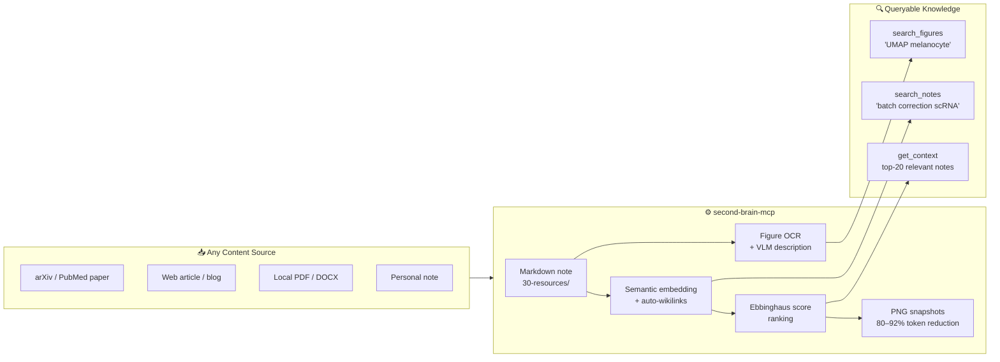

# second-brain MCP Server

**A self-maintaining personal knowledge database — powered by MCP, DuckDB, and biological memory models.**

> **Language:** English · [中文版](README_zh.md)

[](https://github.com/ddmanyes/second-brain-mcp/actions)
[](https://www.python.org/)
[](https://duckdb.org/)
[](https://modelcontextprotocol.io/)
[](LICENSE)

---

## Why Does This Exist?

| Problem | Solution |
| :------ | :------- |
| 📄 You save dozens of papers but can never find the right figure | `search_figures("UMAP melanocyte")` — returns the exact panel, across every paper you've saved |
| 🗂 Notes pile up; older ones never get cleaned up | **Vault Sleep**: low-access notes compress automatically every Sunday while you sleep (60–90% token reduction) |
| 🔎 Semantic search needs a cloud API or Docker stack | Self-hosted `nomic-embed-text` via llama-server; BM25 fallback when offline |
| 🔒 Every AI memory tool locks you into their format | Pure Markdown vault — sync with Google Drive, iCloud, or git; switch agents anytime |
| 🖼 Figure context is lost when you read a paper | Every figure is downloaded, OCR'd by Claude Vision, and stored in DuckDB — searchable by gene name, p-value, axis label |

---

## The One-Command Demo

```text
save_article("https://arxiv.org/abs/2405.01234")
  ↓
• Full paper fetched and converted to Markdown
• All figures downloaded + OCR'd by Claude Vision
• Semantic embeddings computed and linked to related notes
• Stored in 30-resources/ — queryable immediately

search_figures("UMAP cluster batch correction")
  ↓
• Returns the exact figure from the exact paper
• Works across your entire saved literature library
```

---

## What Makes It Different



**Five capabilities no other self-hosted tool combines:**

- 🔬 **Scientific article → searchable database in one command** — `save_article` fetches any URL or PDF, converts to Markdown, downloads every figure, OCRs them with Claude Vision, and builds a semantic index automatically
- 🧠 **Memory that mirrors how brains forget** — Ebbinghaus score ranks notes by recency × access frequency; old low-access notes compress automatically while you sleep
- 🖼 **Figure-level search across your entire library** — `search_figures("p < 0.001")` returns the exact figure from the exact paper, not just the document
- 📉 **Token cost shrinks with age** — PNG snapshots replace full text at 60–92% compression; frequently-read papers always stay full-fidelity
- 🔓 **Zero vendor lock-in** — pure Markdown files, any AI agent via MCP, sync via any cloud drive or git

---

## Example Queries

```python
# Find a specific figure panel across all saved papers
search_figures("p < 0.001 UMAP cluster")

# Semantic search across all notes
search_notes("single cell integration batch correction")

# Decision records for a specific project
get_decisions("MyProject")

# Start a session — Claude loads goals + top-20 relevant notes automatically
get_context()
```

---

## Memory Architecture — Biological Analogy

| Biological Brain | This System |
| :-------------- | :---------- |
| Hippocampal consolidation during sleep | Vault Sleep: weekly LLM-compression of old low-access notes |
| Ebbinghaus forgetting curve | Score-based ranking: `access_count / ln(age_days)` |
| Visual long-term memory | PNG snapshots — resolution degrades gracefully with age |
| Associative recall | Semantic search + auto-generated `[[wikilinks]]` |
| Sleep-dependent consolidation | launchd cron, runs Sunday 02:00 while you sleep |

---

## Token Efficiency

Memory that gets cheaper over time — unlike flat-file systems where old notes cost the same forever.

```text
Note age →   fresh (0–3 mo)   3–6 months     6–12 months    1 year+
             ──────────────   ──────────     ───────────    ───────
token cost:  ██████████████   ██████         ████           ██
             ~1,000 tokens    ~400 tokens    ~256 tokens    ~100 tokens
                              ▼ 60%          ▼ 74%          ▼ 90%
```

> Tier assigned by **score × age** (adaptive). Frequently-accessed notes stay full-text regardless of age.

---

## Search Performance

Measured on Apple Silicon MacBook (20-rep average, BM25-only mode).

```text
Vault    BM25-only p50          Hybrid BM25+semantic p50
──────   ─────────────────      ────────────────────────
10 n     ████░░░░░   21 ms      ████████████   37 ms
50 n     ██████░░░   25 ms      █████████████  39 ms
100 n    ███████░░   27 ms      ██████████████ 45 ms
```

| Vault Size | BM25 p50 | Hybrid p50 | Recall@1 | Recall@5 | MRR |
| :--------: | :------: | :--------: | :------: | :------: | :-: |
| 10 notes | 21 ms | 37 ms | 30% | 60% | 0.42 |
| 50 notes | 25 ms | 39 ms | 70% | 90% | 0.78 |
| 100 notes | 27 ms | 45 ms | 70% | 80% | 0.73 |

> Hybrid mode adds ~18 ms for embedding lookup. Both modes scale sub-linearly with vault size.

---

## System Architecture

```text
┌─────────────────────────────────────────────────────┐
│                    AI Agent Layer                    │
│         Claude Code · Gemini CLI · Any MCP           │
└──────────────────────┬──────────────────────────────┘
                       │ MCP Protocol (19 tools)
┌──────────────────────▼──────────────────────────────┐
│               Layer 2 — MCP Server                   │
│                    server.py                         │
│   get_context · search_notes · save_article · …      │
└──────┬───────────────┬────────────────┬─────────────┘
       │               │                │
┌──────▼──────┐ ┌──────▼──────┐ ┌──────▼──────┐
│  vault_sleep│ │  vault_db   │ │  figures    │
│  compress   │ │  DuckDB FTS │ │  PNG snap   │
│  Phase 3–9  │ │  + semantic │ │  OCR · VLM  │
└──────┬──────┘ └──────┬──────┘ └─────────────┘
       │               │
┌──────▼───────────────▼──────────────────────────────┐
│               Layer 0 — Markdown Vault               │
│   00-inbox · 10-projects · 20-areas · 30-resources   │
│   40-archive · decisions · memory · templates        │
│         (syncs via Google Drive / iCloud / git)      │
└─────────────────────────────────────────────────────┘
```

---

## Vault Sleep — Auto-compression Flow

```text
Every Sunday 02:00 (launchd, no interaction needed)
        │
        ▼
 sync_index + embeddings
        │
        ▼  age > 90d AND Ebbinghaus score ≤ 0.5
 ┌──────────────────────────────────────┐
 │         Adaptive Tier Selection      │
 │  score > 1.5  →  text  (keep full)  │  ← frequently-read: never compressed
 │  score > 0.8  →  large  ~400 tokens │
 │  score > 0.3  →  base   ~256 tokens │
 │  otherwise    →  small  ~100 tokens │
 └────────────────┬─────────────────────┘
                  │
  Gemini CLI → Claude CLI → naive   (auto-fallback, no LLM required)
                  │
    compressed → vault  /  original → 40-archive/  /  snapshot → .png
```

---

## MCP Tools (19 total)

| Tool | Description |
| :--- | :---------- |
| `get_context` | Session start: goals + top-20 Ebbinghaus-ranked notes + auto-rules |
| `save_article` | **Fetch URL/PDF → Markdown + auto-extract figures** |
| `search_notes` | Hybrid BM25 + semantic search across all notes |
| `search_figures` | **Search figure OCR text / VLM descriptions** |
| `extract_figures_for` | Manually trigger figure extraction for a saved article |
| `read_note` | Read note + record access (updates Ebbinghaus score) |
| `read_note_as_image` | Return PNG snapshot for token-efficient reading |
| `new_note` | Create note with correct template and folder by type |
| `get_decisions` | List ADR decision records, optionally filtered by project |
| `update_goals` | Update `memory/goals.md` |
| `sync_index` | Rebuild DuckDB index from vault files |
| `index_stats` | Show note counts by type |
| `vault_sleep` | Compress old low-activity notes (dry_run=True by default) |
| `sleep_status` | Show compression candidates without acting |
| `snapshot_note_tool` | Render note to PNG at chosen resolution tier |
| `extract_rules_tool` | Extract L3 rules from frequently-accessed notes |
| `consolidate_tool` | Merge semantically similar notes into one abstract note |
| `update_links_tool` | Refresh auto-generated `[[wikilinks]]` |
| `prune_archive_tool` | Delete archived originals that have a PNG snapshot |

---

## Test Results

```text
tests/test_figures.py      19 passed   (OCR, snapshots, VLM)
tests/test_server.py       13 passed   (MCP tools, path safety)
tests/test_vault_db.py     33 passed   (FTS, semantic search, embeddings)
tests/test_vault_sleep.py  50 passed   (compression, consolidation, rules, prune)
────────────────────────────────────────
115 passed in 3.37s
```

---

## Installation

### Prerequisites

| Dependency | Required | Notes |
| :--------- | :------: | :---- |
| Python 3.11+ | ✅ | |
| [uv](https://docs.astral.sh/uv/) | ✅ | Package manager |
| [Playwright](https://playwright.dev/) | ✅ | PNG snapshot rendering |
| [llama-server](https://github.com/ggerganov/llama.cpp) | Optional | Semantic search; BM25 fallback if absent |
| [nomic-embed-text-v1.5.Q8_0.gguf](https://huggingface.co/nomic-ai/nomic-embed-text-v1.5-GGUF) | Optional | ~300 MB embedding model |
| Gemini CLI or `ANTHROPIC_API_KEY` | Optional | Better compression quality; naive fallback if absent |

### Quick Start

#### Step 1 — Clone and install

```bash
git clone https://github.com/ddmanyes/second-brain-mcp
cd second-brain-mcp
uv sync
uv run playwright install chromium
```

#### Step 2 — Create your vault

```bash
mkdir -p ~/second-brain/{00-inbox,10-projects,20-areas,30-resources,40-archive,decisions,memory,templates}
```

#### Step 3 — Configure MCP

```bash
cp mcp_config.example.json mcp_config.json
# Edit mcp_config.json — set SECOND_BRAIN_PATH to your vault path
```

#### Step 4 — Register with your AI agent

Option A: **Claude Code (CLI)**

```bash
claude mcp add --scope user second-brain \
  uv run --project /path/to/second-brain-mcp python server.py
```

Option B: **Claude Desktop** — add to `~/Library/Application Support/Claude/claude_desktop_config.json`:

```json
{
  "mcpServers": {
    "second-brain": {
      "command": "uv",
      "args": ["run", "--project", "/path/to/second-brain-mcp", "python", "server.py"],
      "env": { "SECOND_BRAIN_PATH": "/path/to/your/vault" }
    }
  }
}
```

#### Step 5 — Index your vault

In Claude Code or Claude Desktop, tell the agent:

```text
Run sync_index to build the initial index.
```

### Environment Variables

| Variable | Default | Description |
| :------- | :------ | :---------- |
| `SECOND_BRAIN_PATH` | `~/second-brain` | Path to your vault directory |
| `EMBED_URL` | `http://localhost:11435/v1/embeddings` | Embedding server endpoint |
| `EMBED_MODEL` | `nomic-embed-text` | Embedding model name |
| `EMBED_PORT` | `11435` | llama-server port |

### Auto-start (macOS, optional)

```bash
# Embedding server — always on, restarts on crash
cp examples/launchd/com.yourname.llama-embed.plist ~/Library/LaunchAgents/
# Edit paths inside the file, then:
launchctl load ~/Library/LaunchAgents/com.yourname.llama-embed.plist

# Weekly vault maintenance — every Sunday 02:00
cp examples/launchd/com.yourname.vault-sleep.plist ~/Library/LaunchAgents/
launchctl load ~/Library/LaunchAgents/com.yourname.vault-sleep.plist
```

---

## Vault Structure

```text
vault/
├── 00-inbox/          # Unprocessed captures — clear daily
├── 10-projects/       # Active projects
├── 20-areas/
│   ├── research/      # Ongoing research domains
│   ├── coding/        # Dev tools and workflows
│   └── consolidated/  # Auto-merged similar notes (Phase 8)
├── 30-resources/      # ← Papers and articles (save_article writes here)
├── 40-archive/        # Compressed originals (auto-managed by vault_sleep)
├── decisions/         # Architecture Decision Records (ADR format)
├── memory/
│   ├── goals.md       # Current priorities — injected at every session start
│   ├── index.md       # Vault map
│   └── rules.md       # Auto-extracted L3 rules — injected at every session start
└── templates/         # Note templates (note, decision, project, research)
```

---

## Running Tests

```bash
uv run pytest tests/ -v
uv run python benchmark.py --quick --markdown   # search latency + accuracy report
```

---

## Contributing

PRs and Issues welcome. Please open an issue first to discuss significant changes.

---

## License

MIT License — © 2026 Chan Chi Ru. See [LICENSE](LICENSE).
