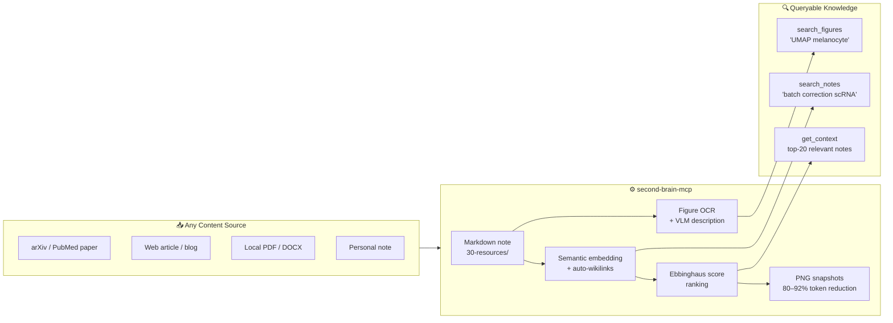
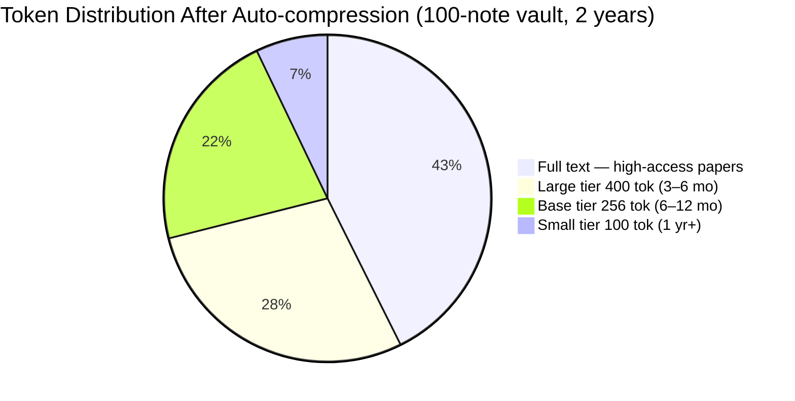
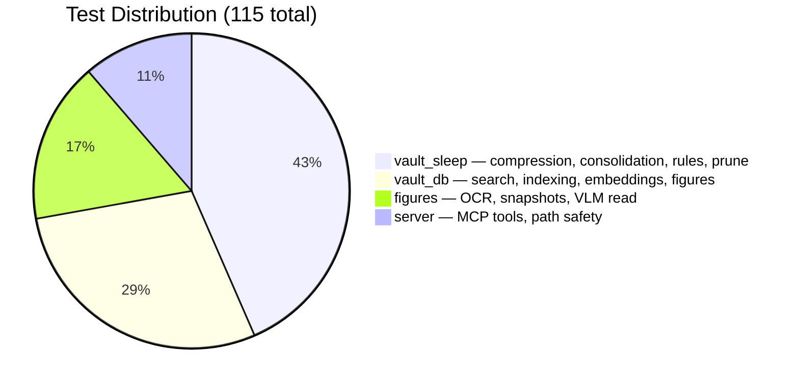

# second-brain MCP Server

> Turn any URL, PDF, or note into a searchable knowledge database — with figure OCR, semantic search, and memory that compresses itself while you sleep.


---

## The Core Idea

Most AI memory tools just "remember what you said." This system does something different: it builds a **searchable database from any content** — especially scientific literature — and models how biological memory actually works.

```
save_article("https://arxiv.org/abs/2405.01234")
  ↓
• Full paper → Markdown (auto-converted)
• All figures downloaded + OCR'd by Claude Vision
• Semantic embeddings computed
• Auto-linked to related notes in your vault

search_figures("UMAP cluster melanocyte")
  ↓
• Returns exact figure + caption from the paper
• Works across every paper you've ever saved
```

**One command to save a paper. One query to find a figure — across your entire literature library.**

---

## What Makes It Different



**Five capabilities no other self-hosted tool combines:**

- 🔬 **Scientific article → searchable database in one command** — `save_article` fetches any URL or PDF, converts to Markdown, downloads every figure, OCRs them with Claude Vision, and builds a semantic index automatically
- 🧠 **Memory that mirrors how brains forget** — Ebbinghaus score ranks notes by recency × access frequency; old low-access notes compress automatically while you sleep
- 🖼 **Figure-level search across your entire library** — `search_figures("p < 0.001")` returns the exact figure from the exact paper, not just the document
- 📉 **Token cost shrinks with age** — PNG snapshots replace full text at 60–92% compression; frequently-read papers always stay full-fidelity
- 🔓 **Zero vendor lock-in** — pure Markdown files, any AI agent via MCP, sync via any cloud drive or git

---

## Scientific Literature Workflow

```
┌─────────────────────────────────────────────────────────────────┐
│  Input: any URL · arXiv · PubMed · PDF · blog · docs page       │
└──────────────────────────┬──────────────────────────────────────┘
                           │  save_article("https://...")
                           ▼
              ┌────────────────────────┐
              │  MarkItDown converter  │  ← handles HTML, PDF, DOCX
              │  arXiv /abs → /html   │  ← auto full-text upgrade
              └────────────┬───────────┘
                           │
           ┌───────────────┼───────────────┐
           ▼               ▼               ▼
    ┌─────────────┐ ┌────────────┐ ┌─────────────────┐
    │  Markdown   │ │  Figures   │ │  Semantic index  │
    │  30-resources│ │  OCR + VLM │ │  nomic-embed    │
    │  .md file   │ │  DuckDB    │ │  auto-wikilinks  │
    └─────────────┘ └────────────┘ └─────────────────┘
           │               │
           └───────────────┴──────────────────────────┐
                                                      ▼
                                        search_figures("TYRP1")
                                        search_notes("scRNA-seq harmony")
                                        → returns ranked results with
                                          figure previews + paper context
```

### Example Queries After Saving Papers

```python
# Find a specific figure across all saved papers
search_figures("p < 0.001 UMAP cluster")

# Find papers about a method
search_notes("single cell integration batch correction")

# Find decision records for your own project
get_decisions("Evo_PRISM")

# Ask Claude: "summarise everything I know about melanocyte markers"
# → Claude calls search_notes + read_note automatically
```

---

## Memory Architecture — Biological Analogy

| Biological Brain | This System |
| --------------- | ----------- |
| Hippocampal consolidation during sleep | Vault Sleep: weekly LLM-compression of old notes |
| Ebbinghaus forgetting curve | Score-based ranking: `access_count / ln(age_days)` |
| Visual long-term memory | PNG snapshots — resolution degrades gracefully with age |
| Associative recall | Semantic search + auto-generated `[[wikilinks]]` |
| Sleep-dependent consolidation | launchd cron, runs Sunday 02:00 while you sleep |

---

## Token Efficiency

Memory that gets cheaper over time — old notes compress automatically while high-access papers always stay full-fidelity.

```text
Note age →     fresh        3 months      6 months       1 year+
               │            │             │              │
token cost:  ██████████   ████          ██▌            █
             ~1000 tok    ~400 tok      ~256 tok       ~100 tok
             (full text)  large tier    base tier      small tier
                          ▼ 60%         ▼ 74%          ▼ 90%
```



> Tier assigned by **score × age** (Phase 9 adaptive). Frequently-accessed notes stay full-text regardless of age.

---

## Search Performance

Measured on Apple Silicon MacBook (20-rep average). Both modes scale sub-linearly with vault size.

```text
Vault size    BM25-only (p50)    Hybrid BM25+semantic (p50)
──────────    ───────────────    ──────────────────────────
   10 notes   ████░░░░░  21 ms   ██████████░  37 ms
   50 notes   ██████░░░  25 ms   ████████████ 39 ms
  100 notes   ███████░░  27 ms   ██████████████ 45 ms
```

> Hybrid adds ~18 ms for embedding lookup — negligible for interactive use.

| Vault Size | BM25 p50 | Hybrid p50 | Recall@1 | Recall@5 | MRR |
| :--------: | :------: | :--------: | :------: | :------: | :-: |
| 10 notes  | 21 ms | 37 ms | 30% | 60% | 0.42 |
| 50 notes  | 25 ms | 39 ms | 70% | 90% | 0.78 |
| 100 notes | 27 ms | 45 ms | 70% | 80% | 0.73 |

---

## System Architecture

```
┌─────────────────────────────────────────────────────┐
│                    AI Agent Layer                    │
│         Claude Code · Gemini CLI · Any MCP           │
└──────────────────────┬──────────────────────────────┘
                       │ MCP Protocol (19 tools)
┌──────────────────────▼──────────────────────────────┐
│               Layer 2 — MCP Server                   │
│                    server.py                         │
│   get_context · search_notes · save_article · …      │
└──────┬───────────────┬────────────────┬─────────────┘
       │               │                │
┌──────▼──────┐ ┌──────▼──────┐ ┌──────▼──────┐
│  vault_sleep│ │  vault_db   │ │  figures    │
│  compress   │ │  DuckDB FTS │ │  PNG snap   │
│  Phase 3–9  │ │  + semantic │ │  OCR · VLM  │
└──────┬──────┘ └──────┬──────┘ └─────────────┘
       │               │
┌──────▼───────────────▼──────────────────────────────┐
│               Layer 0 — Markdown Vault               │
│   00-inbox · 10-projects · 20-areas · 30-resources   │
│   40-archive · decisions · memory · templates        │
│         (syncs via Google Drive / iCloud / git)      │
└─────────────────────────────────────────────────────┘
```

---

## Vault Sleep — Auto-compression Flow

```
Every Sunday 02:00 (launchd, no interaction needed)
        │
        ▼
 sync_index + embeddings
        │
        ▼  age > 90d AND score ≤ 0.5
 ┌──────────────────────────────────┐
 │       Adaptive Tier Selection    │
 │  score > 1.5  →  text (no comp) │  ← frequently-read papers: keep full
 │  score > 0.8  →  large  400 tok │
 │  score > 0.3  →  base   256 tok │
 │  otherwise    →  small  100 tok │
 └──────────────┬───────────────────┘
                │
 Gemini CLI → Claude CLI → naive   (auto-fallback, no LLM required)
                │
   compressed → vault / original → archive / snapshot → .png
```

---

## MCP Tools (19 total)

| Tool | Description |
| ---- | ----------- |
| `get_context` | Session start: goals + top-20 Ebbinghaus-ranked notes + auto-rules |
| `save_article` | **Fetch URL/PDF → Markdown + auto-extract figures** |
| `search_notes` | Hybrid BM25 + semantic search across all notes |
| `search_figures` | **Search figure OCR text / VLM descriptions** |
| `extract_figures_for` | Manually trigger figure extraction for a saved article |
| `read_note` | Read note + record access (updates Ebbinghaus score) |
| `read_note_as_image` | Return PNG snapshot for token-efficient reading |
| `new_note` | Create note with correct template/folder by type |
| `get_decisions` | List ADR decision records, optionally filtered by project |
| `update_goals` | Update `memory/goals.md` |
| `sync_index` | Rebuild DuckDB index from vault files |
| `index_stats` | Show note counts by type |
| `vault_sleep` | Compress old low-activity notes (dry_run by default) |
| `sleep_status` | Show compression candidates without acting |
| `snapshot_note_tool` | Render note to PNG at chosen resolution tier |
| `extract_rules_tool` | Extract L3 rules from frequently-accessed notes |
| `consolidate_tool` | Merge semantically similar notes into one |
| `update_links_tool` | Refresh auto-generated wikilinks |
| `prune_archive_tool` | Delete archived originals that have a PNG snapshot |

---

## Test Results

```
tests/test_figures.py     ···················   19 passed
tests/test_server.py      ·············         13 passed
tests/test_vault_db.py    ·······················
                          ········               33 passed
tests/test_vault_sleep.py ···················
                          ·····················
                          ··········            50 passed
──────────────────────────────────────────────────────
115 passed in 3.37s
```



---

## Installation

### Prerequisites

| Dependency | Required | Notes |
| --------- | ------- | ----- |
| Python 3.11+ | ✅ | |
| [uv](https://docs.astral.sh/uv/) | ✅ | Package manager |
| [Playwright](https://playwright.dev/) | ✅ | PNG snapshot rendering |
| [llama-server](https://github.com/ggerganov/llama.cpp) | Optional | Semantic search; BM25 fallback if absent |
| [nomic-embed-text-v1.5.Q8_0.gguf](https://huggingface.co/nomic-ai/nomic-embed-text-v1.5-GGUF) | Optional | Embedding model (~300 MB) |
| Gemini CLI or `ANTHROPIC_API_KEY` | Optional | Better LLM compression; naive fallback if absent |

### Quick Start

```bash
# 1. Clone
git clone https://github.com/yourname/second-brain-mcp
cd second-brain-mcp

# 2. Install
uv sync
uv run playwright install chromium

# 3. Create vault structure
mkdir -p ~/second-brain/{00-inbox,10-projects,20-areas,30-resources,40-archive,decisions,memory,templates}

# 4. Configure MCP
cp mcp_config.example.json mcp_config.json
# Edit: set SECOND_BRAIN_PATH to your vault path

# 5. Register with Claude Code
claude mcp add --scope user second-brain \
  uv run python $(pwd)/server.py

# 6. Index your vault
# In Claude Code: tell the agent to run sync_index
```

### Environment Variables

| Variable | Default | Description |
| ------- | ------- | ----------- |
| `SECOND_BRAIN_PATH` | `~/second-brain` | Path to your vault |
| `EMBED_URL` | `http://localhost:11435/v1/embeddings` | Embedding endpoint |
| `EMBED_MODEL` | `nomic-embed-text` | Model name |
| `EMBED_PORT` | `11435` | llama-server port |

### Auto-start (macOS)

```bash
# Embedding server (always-on)
cp examples/launchd/com.yourname.llama-embed.plist ~/Library/LaunchAgents/
# edit paths, then:
launchctl load ~/Library/LaunchAgents/com.yourname.llama-embed.plist

# Weekly vault maintenance (Sunday 02:00)
cp examples/launchd/com.yourname.vault-sleep.plist ~/Library/LaunchAgents/
launchctl load ~/Library/LaunchAgents/com.yourname.vault-sleep.plist
```

---

## Vault Structure

```text
vault/
├── 00-inbox/          # Unprocessed captures
├── 10-projects/       # Active projects
├── 20-areas/
│   ├── research/      # Ongoing research domains
│   ├── coding/        # Dev tools and workflows
│   └── consolidated/  # Auto-merged similar notes
├── 30-resources/      # ← Papers and articles live here (save_article target)
├── 40-archive/        # Compressed originals (auto-managed)
├── decisions/         # Architecture Decision Records (ADR format)
├── memory/
│   ├── goals.md       # Current priorities — injected every session
│   ├── index.md       # Vault map
│   └── rules.md       # Auto-extracted L3 rules — injected every session
└── templates/
```

---

## Running Tests

```bash
uv run pytest tests/ -v
uv run python benchmark.py --quick --markdown   # search latency + accuracy
```

---

## License

MIT
